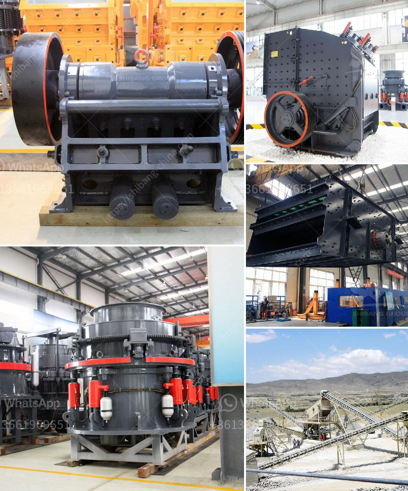

<h3>stone jaw crusher machine</h3>
Jaw crusher machine is a very common type of crushing equipment used for crushing different types of materials. It is commonly used in various industry sectors such as mining, smelting, building materials, roads, railways, water conservancy and chemical industries. Due to its simplicity and reliability, customers in these industries are willing to invest in this equipment.

The stone jaw crusher machine is widely used in mining, smelting, building materials, roads, railways, water conservancy, and chemical industries. It is the preferred equipment for crushing materials such as mines, building materials, metallurgy, chemical industry, coal, and others. Various minerals and rocks can be crushed with a jaw crusher machine.

The common features of jaw crushers are high reliability, strong durability, and stable operation. The stone jaw crusher machine has a simple structure, easy manufacturing, reliable operation, and convenient maintenance. There are different types of stone jaw crusher machine operating conditions to improve the jaw crusher performance, such as jaw crusher eccentric shaft, jaw crusher eccentric shaft, jaw crusher wedge block, and so on.

Jaw crusher is popular among users due to its simple structure, large feed size, high output, and convenient maintenance. Its working principle is that the motor drives the belt and pulley to move the jaw up and down through the eccentric shaft. When the jaw plate rises, the angle between the fixed jaw plate and the movable jaw plate becomes larger, thereby pushing the movable jaw plate closer to the fixed jaw plate, and the material is crushed or split.

The stone jaw crusher machine is widely used in the primary and secondary crushing of hard materials in the industries of mining, metallurgy, chemical industry, building materials, water conservancy, transportation, etc. These industries require strong and hard materials to be crushed for better use.

In addition to the advantages of strong reliability, high production efficiency, and easy maintenance of the stone jaw crusher machine, the noise and vibration of the jaw crusher are small, starting fast and stopping fast, which improves the equipment performance of the whole production line.

On the other hand, stone jaw crusher machine has a series of disadvantages, such as complex structure, difficult installation and transportation, high initial investment, and complicated maintenance. The jaw crusher’s vibrating feeders and vibrating screen are prone to blockages and require regular cleaning and maintenance. The eccentric shaft bearing may crack, causing the whole equipment to stop working.

In conclusion, stone jaw crusher machine is widely used in mining, metallurgy, chemical industry, building materials, roads, railways, water conservancy, and other industries. It is characterized by uncomplicated structure, high reliability, convenient maintenance, and low operating cost. It has a wide range of application and can crush various materials with a compressive strength not exceeding 320MPa. However, it also has certain disadvantages in terms of installation, maintenance, and initial investment. Therefore, it is crucial for users to comprehensively consider the advantages and disadvantages of stone jaw crusher machine before making a decision.
<h3>Contact us</h3><ul><li><strong>Whatsapp:&nbsp;<a href="https://wa.me/8613661969651">+8613661969651</a></strong></li><li><a href="https://swt.shibang-china.com/?git&amp;zhl&amp;stone jaw crusher machine"><strong>Online Service(chat now)</strong></a></li></ul><h3>Related</h3><ul><li><a href='price jaw crusher price stone crusher.md'>price jaw crusher price stone crusher</a></li><li><a href='mining rental equipment south africa.md'>mining rental equipment south africa</a></li><li><a href='gold mining mercury.md'>gold mining mercury</a></li><li><a href='start a quarry plant.md'>start a quarry plant</a></li><li><a href='sell plant of crushing mobile.md'>sell plant of crushing mobile</a></li></ul>