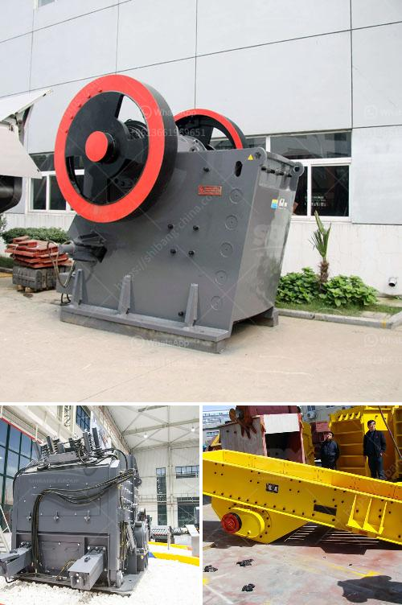

<h3>stone medina stone mobile crusher</h3>
In the world of construction, efficiency and productivity are paramount. Time is of the essence, and every minute counts when it comes to completing projects on schedule. One significant factor that influences these aspects is the choice of machinery used on construction sites. One such machine that has revolutionized the construction industry is the stone Medina stone mobile crusher.

The stone Medina stone mobile crusher is a powerful piece of equipment that utilizes its robust jaw crusher mechanism to crush large rocks into smaller pieces suitable for use in construction projects. This crusher has been designed with the utmost efficiency in mind, allowing construction companies to maximize their productivity and reduce costs in the process.

One of the primary advantages of the stone Medina stone mobile crusher is its mobility. Unlike traditional crushers, which are fixed in one location, this mobile crusher can be easily transported to various sites. Construction companies can move the crusher to where it is needed, eliminating the need for expensive transportation of materials. This mobility allows for greater flexibility in project planning and execution.

Additionally, the stone Medina stone mobile crusher is equipped with a powerful engine that can handle even the toughest materials. Its jaw crusher mechanism can effortlessly crush rocks with high compressive strength, making it suitable for a wide range of construction applications. From road construction to building foundations, this crusher can process various materials, including concrete, asphalt, and natural stone.

Not only does the stone Medina stone mobile crusher have the capability to crush large rocks, it can also sort and separate them into different sizes. This feature is particularly useful when construction sites require specific size requirements for the materials being used. The crusher can produce a variety of sizes, ranging from small gravel to larger stones, making it versatile and adaptable to different construction needs.

Moreover, the stone Medina stone mobile crusher operates with high efficiency. With its advanced technology and intelligent control system, it can regulate the crushing process to optimize performance. This ensures that the machine operates at maximum capacity while reducing energy consumption. The crusher also features a low noise emission, promoting a safer and more comfortable working environment.

In addition to its efficiency, the stone Medina stone mobile crusher is also easy to maintain. Regular maintenance is essential for the longevity and optimal functioning of any machinery, and this crusher is no exception. Its design incorporates easy access to key components, simplifying the inspection and maintenance processes. This reduces downtime and ensures that the crusher continues to perform at its best.

In conclusion, the stone Medina stone mobile crusher is a game-changer in the construction industry. Its mobility, durability, and efficiency make it the ideal choice for construction companies looking to optimize their productivity and reduce costs. With the ability to crush large rocks into various sizes and its easy maintenance, this crusher is a valuable asset on any construction site. By incorporating the stone Medina stone mobile crusher into their operations, construction companies are paving the way for faster, more efficient projects and ultimately, success.
<h3>Contact us</h3><ul><li><strong>Whatsapp:&nbsp;<a href="https://wa.me/8613661969651">+8613661969651</a></strong></li><li><a href="https://swt.shibang-china.com/?git&amp;zhl&amp;stone medina stone mobile crusher"><strong>Online Service(chat now)</strong></a></li></ul><h3>Related</h3><ul><li><a href='zeolite sand making machine manufacturer.md'>zeolite sand making machine manufacturer</a></li><li><a href='feldspar refining and processing equipment.md'>feldspar refining and processing equipment</a></li><li><a href='grinding zeolite ball mill machine.md'>grinding zeolite ball mill machine</a></li><li><a href='antimony ore processing plant design.md'>antimony ore processing plant design</a></li><li><a href='stone crusher 80 tons of jam.md'>stone crusher 80 tons of jam</a></li></ul>