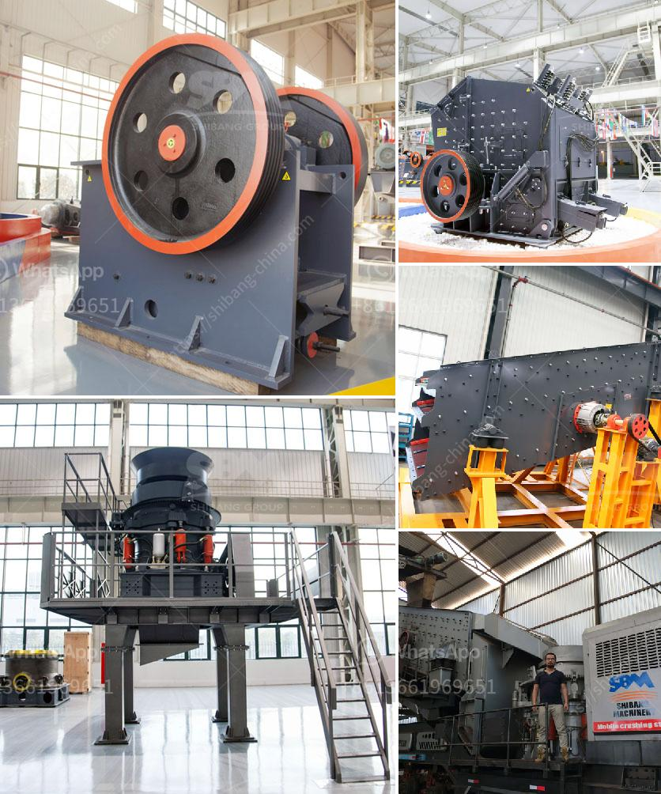

<h3>stone principle crusher project</h3>
The stone principle crusher project for stone crushing needs that turn stones into small pieces of rock, that are further used for various construction purposes. Stone crushers are designed to reduce the size of stones in various industries, such as mining, construction, and recycling. These machines can break down large stones into smaller pieces, making it easier to transport and use them.

The stone principle crusher project is an important factor in the success of stone crushing plants. However, due to the technological advancements and high demand for quality stone products, more and more stone crushers are being developed to meet the requirements of various industries. The stone principle crusher project utilizes advanced crushing technology to produce superior-quality crushed stones that are perfectly suited for construction purposes.

The stone principle crusher project is not a single machine but a team of heavy-duty machines combined together to achieve the desired crushing results. The primary crusher is responsible for breaking down large stones into smaller pieces, which are then further processed by secondary and tertiary crushers. These smaller pieces are finally transformed into the required size and shape for various construction purposes.

Some of the key features of the stone principle crusher project include high efficiency, low maintenance, and user-friendly operation. These machines are designed to provide maximum productivity and minimal downtime, ensuring smooth and continuous stone crushing operations. The stone principle crusher project is also equipped with advanced safety features to protect workers and prevent accidents.

One of the key benefits of the stone principle crusher project is its ability to produce high-quality crushed stones. Crushed stones are used in various construction projects, such as building foundations, road construction, landscaping, and concrete production. The stone principle crusher project ensures that each stone is crushed to the required specifications, resulting in superior-quality crushed stones that are highly sought after in the construction industry.

Another advantage of the stone principle crusher project is its cost-effectiveness. By efficiently crushing large stones into smaller pieces, these machines reduce the transportation and handling costs associated with stone products. Additionally, the stone principle crusher project offers significant energy savings, resulting in lower operational costs and increased profitability for stone crushing plants.

In conclusion, the stone principle crusher project plays a vital role in the success of stone crushing plants. It utilizes advanced technology to efficiently crush large stones into smaller pieces, generating high-quality crushed stones that are preferred by various industries. With its cost-effectiveness and ability to produce superior-quality crushed stones, the stone principle crusher project is an essential component of any stone crushing operation.
<h3>Contact us</h3><ul><li><strong>Whatsapp:&nbsp;<a href="https://wa.me/8613661969651">+8613661969651</a></strong></li><li><a href="https://swt.shibang-china.com/?git&amp;zhl&amp;stone principle crusher project"><strong>Online Service(chat now)</strong></a></li></ul><h3>Related</h3><ul><li><a href='ball mill in mumbai.md'>ball mill in mumbai</a></li><li><a href='used portable crusher for sale in germany.md'>used portable crusher for sale in germany</a></li><li><a href='bentonite processing plant.md'>bentonite processing plant</a></li><li><a href='coal crusher machine pdf.md'>coal crusher machine pdf</a></li><li><a href='the process of cement making with ball mills.md'>the process of cement making with ball mills</a></li></ul>