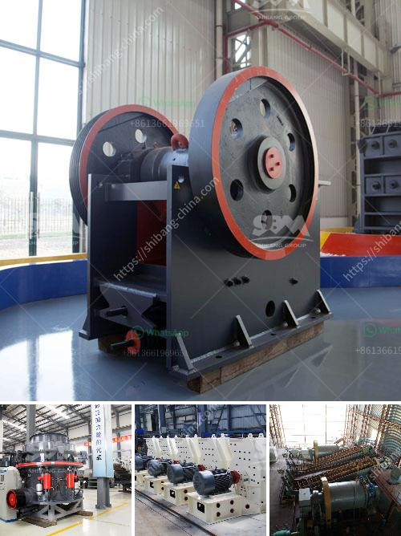

<h3>stone quarries in uganda</h3>
Stone quarries are a common feature in the Ugandan landscape. Many people in rural Uganda engage in small-scale stone extraction for both domestic and commercial purposes. This stone quarrying has significant economic and social implications, but it is also associated with environmental and health concerns.

The stone quarrying industry in Uganda is regulated by the Mining Act 2003 and the Mining Regulations 2004. The commissioner general of the Uganda Revenue Authority licenses all aggregates firms and individuals involved in the trade. The licenses are issued under the Taxes Management Act 2014.

Stone quarries are scattered throughout Uganda, where they are mined directly from the hillsides. Most of these quarries are in Nakaseke district, Mbale district, and Wakiso district. Over the years, these quarries have formed an essential part of the local economy, providing employment opportunities to many Ugandans.

One of the primary uses of stones acquired in these quarries is for the construction industry. Stones are essential for the production of concrete, roadbase, and other building materials. The demand for building materials in Uganda has been steadily increasing due to the rapid urbanization and infrastructural development happening across the country. Stone quarries help meet this demand by supplying the necessary raw materials for construction projects.

In addition to the economic benefits, stone quarries also have social implications. They provide employment opportunities for local communities, both as quarry workers and as suppliers of labor and materials. This plays a vital role in reducing unemployment rates and improving living standards in rural areas. Moreover, the revenue generated from stone quarrying contributes to the local economy by stimulating other businesses and services in the region.

However, stone quarrying in Uganda is not without its challenges. One significant concern is the environmental impact of the quarries. Quarrying activities often result in the destruction of ecosystems, deforestation, and soil erosion. The extraction of stones can also lead to changes in the landscape, altering water flow patterns and increasing the risk of flooding. It is crucial to balance the economic benefits of the stone quarrying industry with the need for environmental sustainability.

The health hazards associated with stone quarrying are another important concern. Workers in the quarries are exposed to hazardous dust particles and chemicals, which can lead to respiratory problems, skin diseases, and other occupational ailments. Adequate protective measures, such as the provision of masks and safe working conditions, should be implemented to ensure the well-being of the quarry workers.

To address these challenges, the Ugandan government has taken steps to regulate the stone quarrying industry. Stricter regulations have been put in place to ensure sustainable extraction practices, including the requirement for Environmental Impact Assessments (EIAs) before the commencement of quarrying activities. The government has also partnered with international organizations to provide training programs on occupational health and safety for quarry workers.

In conclusion, stone quarries play a vital role in Uganda's economy by supplying raw materials for the construction industry and creating employment opportunities for local communities. However, there are challenges associated with the industry, including environmental degradation and health hazards. It is necessary to implement effective regulations and promote sustainable quarrying practices to ensure the long-term viability of this industry while safeguarding the environment and the health of the workers.
<h3>Contact us</h3><ul><li><strong>Whatsapp:&nbsp;<a href="https://wa.me/8613661969651">+8613661969651</a></strong></li><li><a href="https://swt.shibang-china.com/?git&amp;zhl&amp;stone quarries in uganda"><strong>Online Service(chat now)</strong></a></li></ul><h3>Related</h3><ul><li><a href='central crushing granite.md'>central crushing granite</a></li><li><a href='sale ghana grinding crusher.md'>sale ghana grinding crusher</a></li><li><a href='cement grinding mills.md'>cement grinding mills</a></li><li><a href='industrial fine powder grinder.md'>industrial fine powder grinder</a></li><li><a href='custom milling for small scale mining.md'>custom milling for small scale mining</a></li></ul>