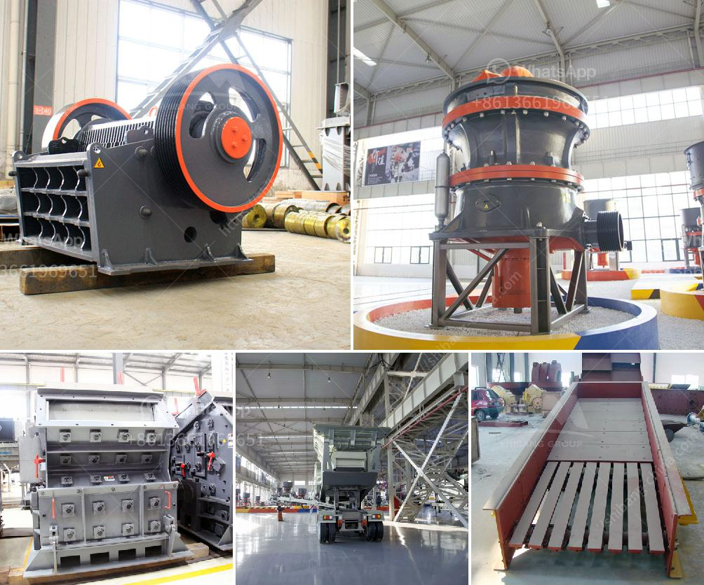

<h3>stone quarry process</h3>
The Earth's surface is made up of various types of rocks. Some rocks are soft, while others are hard and durable. Stone quarrying is the process of extracting these valuable resources from the ground. People have been quarrying stones for thousands of years, utilizing methods such as digging trenches and blasting with explosives.

The process of stone quarrying begins with the exploration and removal of deposits from the ground's surface or depth. Depending on the size, shape, and quality of the stone, various excavation methods can be adopted. In open-pit mining, the quarry is initiated by removing the vegetation and topsoil layers to expose the bedrock. Then, explosives are used to break the rock into manageable pieces.

After the initial excavation, heavy machinery such as crushers and bulldozers are brought in to crush and transport the stones. These machines reduce the size of the stones into smaller chunks, making them easier to handle and transport. The stones are then loaded onto trucks or rail cars and transported to their final destinations.

Once the stones arrive at their destination, they are shaped and processed according to their intended use. Some stones may be cut into slabs or blocks for construction purposes, while others may be crushed into gravel or crushed stone for road base or landscaping applications. Specialized equipment and machinery are used at this stage to achieve the desired shape, size, and finish of the stone.

Stone quarrying has provided essential building materials for centuries, contributing to the development of cities, roads, bridges, and other infrastructure. However, it is important to ensure that quarrying activities are carried out in an environmentally sustainable manner. Strict regulations are in place to minimize the impact on the environment and surrounding communities.

In conclusion, the stone quarrying process involves the extraction, transportation, and processing of stones from the Earth's surface. It is a crucial industry that has contributed to civilizations throughout history. With proper management and regulations, stone quarrying can continue to meet the demand for building materials while minimizing its environmental footprint.
<h3>Contact us</h3><ul><li><strong>Whatsapp:&nbsp;<a href="https://wa.me/8613661969651">+8613661969651</a></strong></li><li><a href="https://swt.shibang-china.com/?git&amp;zhl&amp;stone quarry process"><strong>Online Service(chat now)</strong></a></li></ul><h3>Related</h3><ul><li><a href='industrial grinder in algeria.md'>industrial grinder in algeria</a></li><li><a href='vertical mill calcium.md'>vertical mill calcium</a></li><li><a href='zinc ore processing plant.md'>zinc ore processing plant</a></li><li><a href='all about ball mills.md'>all about ball mills</a></li><li><a href='ball mill south africa.md'>ball mill south africa</a></li></ul>