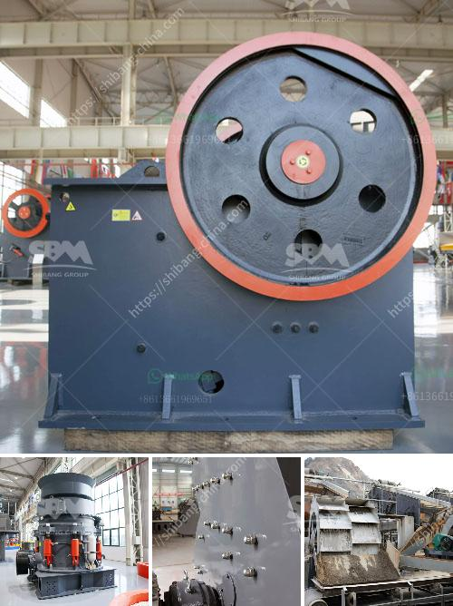

<h3>stones grinding plant thailand</h3>
Thailand, known for its rich natural resources, is a hub for various industries. With its booming construction sector, the demand for quality construction materials continues to grow. One such material is stones, which are extensively used in building projects, roads, bridges, and more. To meet this growing demand, Thailand has embraced the concept of stones grinding plants, which enhance the production of this key construction material.

A stones grinding plant is a facility where large rocks are crushed into smaller pieces to produce gravel, sand, or other desirable materials used for construction. The process involves the use of heavy-duty machinery to grind these stones into the desired size and shape. With the significant development in infrastructure projects across Thailand, the establishment of grinding plants has become crucial to meet the surging demand for construction materials.

One of the reasons why stones grinding plants have gained popularity in Thailand is their ability to provide cost-effective and high-quality materials. These plants employ advanced machinery and technology that ensure efficient grinding processes. By efficiently crushing rocks into smaller-sized stones, the plants can produce a higher quantity of construction materials in a shorter period. This increased production capacity not only meets the growing demand but also ensures a steady supply of stones for ongoing and upcoming construction projects.

Moreover, stones grinding plants offer a wide range of stone products that cater to different specifications required by builders and contractors. These plants have the capability to produce various sizes of stones, including different grades of gravel and sand. This versatility allows for customization to meet specific project requirements. Whether it's as fine as sand for plastering or larger stones for road infrastructure, stones grinding plants can deliver the required materials.

In terms of environmental impact, stones grinding plants have also proved to be favorable. The process of grinding stones involves crushing and pulverizing the rocks using machinery. This eliminates the need for extracting stones from natural quarries, reducing the environmental impact caused by extensive mining activities. Additionally, grinding plants often implement dust control measures to minimize air pollution and create a cleaner working environment for the workers. This sustainable approach aligns with Thailand's commitment to environmental preservation and responsible resource management.

Furthermore, the establishment of stones grinding plants also benefits the local economy by creating employment opportunities. These plants require a skilled workforce to operate and maintain the machinery. With the expansion of grinding plant facilities in various regions, job opportunities are generated for engineers, technicians, operators, and other related professions. This not only boosts local employment but also contributes towards the overall economic growth of the country.

In conclusion, stones grinding plants in Thailand have emerged as a vital component in meeting the escalating demand for construction materials. With their efficient production processes, ability to produce a variety of stone products, and positive environmental impact, these plants have become integral to the construction industry. As Thailand continues to develop its infrastructure, the stones grinding plant industry will play a significant role in ensuring a continuous and sustainable supply of quality construction materials.
<h3>Contact us</h3><ul><li><strong>Whatsapp:&nbsp;<a href="https://wa.me/8613661969651">+8613661969651</a></strong></li><li><a href="https://swt.shibang-china.com/?git&amp;zhl&amp;stones grinding plant thailand"><strong>Online Service(chat now)</strong></a></li></ul><h3>Related</h3><ul><li><a href='manufacturer of vertical coal pulverizer mill.md'>manufacturer of vertical coal pulverizer mill</a></li><li><a href='quartz crusher machinery.md'>quartz crusher machinery</a></li><li><a href='estimated cost of setting up a quarry.md'>estimated cost of setting up a quarry</a></li><li><a href='kaolin clay processing flow chart.md'>kaolin clay processing flow chart</a></li><li><a href='ball mill south africa.md'>ball mill south africa</a></li></ul>