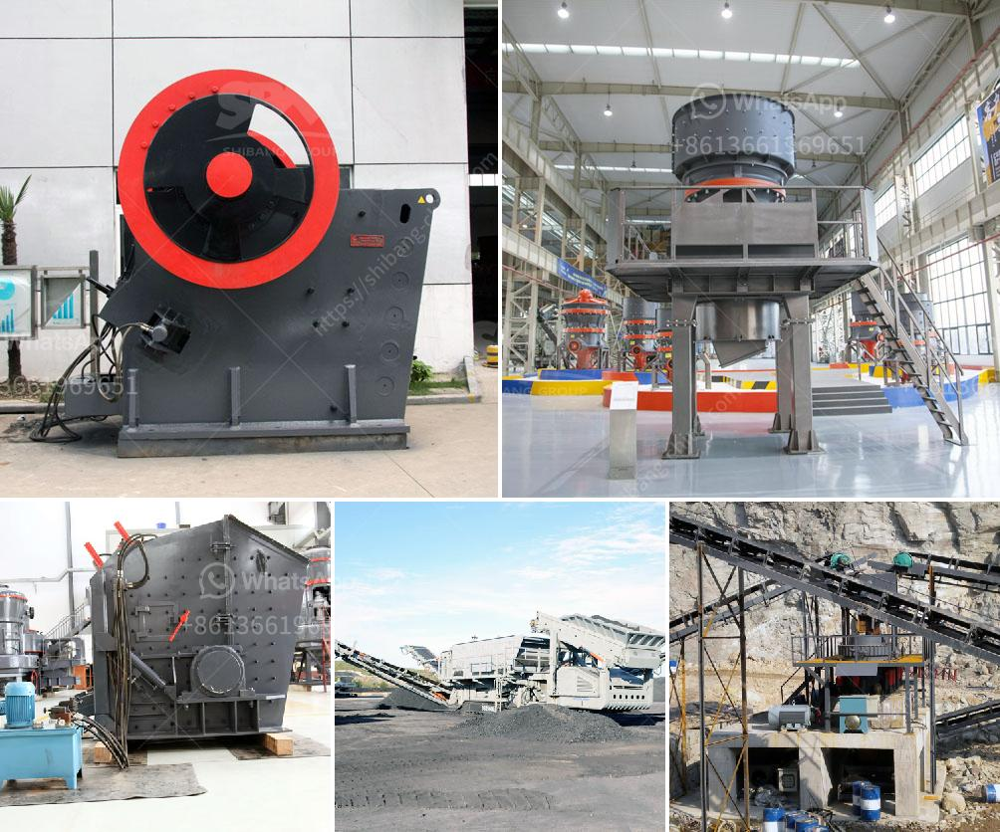

<h3>super fine roller mill</h3>
In the world of industrial production, the process of material grinding plays a crucial role. Grinding is used to refine and shape various materials, enabling them to be used in a wide range of applications. Over the years, different grinding mills have been developed, each with its unique capabilities and advantages. One such mill that has gained popularity in recent times is the super fine roller mill.

A super fine roller mill is a type of grinding machine that is used to finely grind materials for various purposes. It utilizes a series of cylindrical rollers to grind materials to a high degree of fineness, resulting in a more refined and uniform product. This mill offers numerous advantages over traditional grinding mills, making it a preferred choice in many industries.

One of the key advantages of a super fine roller mill is its ability to produce extremely fine and uniform particles. The cylindrical rollers exert a high-pressure grinding force on the materials, breaking them down into smaller particles. This results in a finer, more homogeneous product, enhancing its quality and performance. Industries such as pharmaceuticals, chemicals, and food processing extensively benefit from this capability, as they require materials with precise and consistent particle sizes.

Another significant advantage of the super fine roller mill is its energy efficiency. Compared to other grinding mills, the roller mill consumes less power, reducing the overall energy costs associated with material grinding. This makes it an environmentally friendly solution for industries looking to optimize their energy consumption and reduce their carbon footprint.

Furthermore, the super fine roller mill offers improved control and flexibility in the grinding process. It allows for adjustable grinding settings, enabling operators to achieve the desired fineness and particle size distribution for their specific applications. This versatility not only increases the mill's efficiency but also allows for greater customization, catering to the varying needs of different industries.

Additionally, the super fine roller mill features a compact design, making it ideal for space-conscious industries or limited workspaces. Its compact size allows for easy integration into existing production lines, reducing the need for substantial layout modifications. Consequently, the roller mill improves overall operational efficiency and reduces downtime, resulting in increased productivity for industries.

The advanced technology and engineering behind the super fine roller mill also ensure its durability and reliability. High-quality components and rigorous quality control measures ensure that the mill can withstand the demands of continuous operation without compromising its performance. This reliability translates into reduced maintenance requirements and increased machine longevity, minimizing downtime and overall maintenance costs.

In conclusion, the super fine roller mill has revolutionized the process of material grinding. With its ability to produce fine and uniform particles, energy efficiency, and improved control, this mill offers several advantages over traditional grinding mills. Its versatility, compact design, and robust construction further enhance its appeal for various industries. As technological advancements continue, it is foreseeable that the super fine roller mill will continue to evolve, further enhancing its performance and expanding its applications in material grinding.
<h3>Contact us</h3><ul><li><strong>Whatsapp:&nbsp;<a href="https://wa.me/8613661969651">+8613661969651</a></strong></li><li><a href="https://swt.shibang-china.com/?git&amp;zhl&amp;super fine roller mill"><strong>Online Service(chat now)</strong></a></li></ul><h3>Related</h3><ul><li><a href='consumption of ball mill with roller.md'>consumption of ball mill with roller</a></li><li><a href='crusher machine distributor in zambia.md'>crusher machine distributor in zambia</a></li><li><a href='coal crusher and screening plants for sale.md'>coal crusher and screening plants for sale</a></li><li><a href='cost of setting up a kaolin production plant.md'>cost of setting up a kaolin production plant</a></li><li><a href='vertical roller pre grinding mill.md'>vertical roller pre grinding mill</a></li></ul>