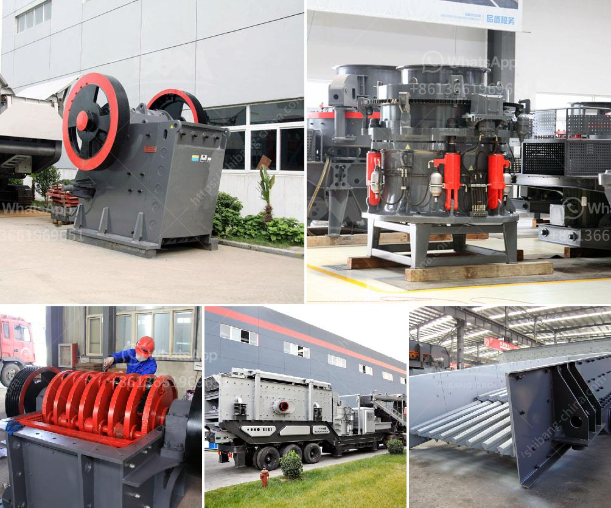

<h3>supplier of gold desorption plant in china</h3>
Title: The Leading Supplier of Gold Desorption Plants in China: A Catalyst for Sustainable Gold Mining

Gold desorption, also known as gold stripping or elution, is a crucial process in gold mining operations. It involves the removal of gold complex ions from activated carbon, allowing for the efficient recovery and recycling of precious metals. In China, one supplier has emerged as a reputable leader in providing top-quality gold desorption plants - a vital contribution to sustainable mining practices. This article explores the features and significance of this notable Chinese supplier in meeting the industry's demand for efficient and eco-friendly gold desorption equipment.

The leading supplier of gold desorption plants in China leverages cutting-edge technology to develop and manufacture advanced equipment tailored to the needs of gold mines. These plants are equipped with superior heating systems, including induction heating and thermal oil heating, which help enhance the efficiency of the gold stripping process. Moreover, innovative designs and configurations enable high-capacity operations while minimizing energy consumption, ensuring significant cost savings for gold mining companies.

Environmental sustainability is a growing concern within the mining industry. To address this, the Chinese supplier prioritizes eco-friendly solutions in the design and production of their gold desorption plants. By incorporating advanced filtration systems, the plants effectively capture and treat harmful pollutants, preventing contamination of both air and water during the desorption process. In addition, the supplier promotes the use of renewable energy sources, such as solar power, for plant operations, further reducing the carbon footprint associated with gold mining.

To maintain its status as a leading supplier, the company ensures the highest standards of quality control throughout the production process. The gold desorption plants are subjected to rigorous testing procedures at every stage, right from the selection of raw materials to the final assembly. The supplier collaborates closely with mining experts to collect feedback, conduct comprehensive research, and continually improve the design and efficiency of their plants. This commitment to quality and continual innovation sets them apart in the market and showcases their dedication to providing reliable and effective equipment.

The Chinese supplier excels in understanding and fulfilling the unique requirements of each gold mining operation. They offer customized solutions and provide extensive technical support to clients, from installation and training to ongoing maintenance. Every desorption plant is designed with user-friendly interfaces, ensuring ease of operation for mining employees. By providing comprehensive aftersales services and prompt responses to customer inquiries, the supplier ensures that clients receive unparalleled support throughout their equipment's lifespan.

The supplier of gold desorption plants in China plays a pivotal role in advancing the gold mining industry's sustainability goals. By developing efficient and environmentally friendly equipment, they contribute to minimizing the environmental impact of gold mining operations. Not only does their cutting-edge technology enhance productivity and cost-effectiveness, but their exceptional quality control measures and customer-centric approach also ensure long-term success for their clients. As the demand for sustainable mining practices rises, the supplier continues to lead the way in providing top-quality gold desorption plants, supporting the industry's transition towards a more responsible and efficient future.
<h3>Contact us</h3><ul><li><strong>Whatsapp:&nbsp;<a href="https://wa.me/8613661969651">+8613661969651</a></strong></li><li><a href="https://swt.shibang-china.com/?git&amp;zhl&amp;supplier of gold desorption plant in china"><strong>Online Service(chat now)</strong></a></li></ul><h3>Related</h3><ul><li><a href='jual jaw crusher bekas surabaya.md'>jual jaw crusher bekas surabaya</a></li><li><a href='crushers of jaw china.md'>crushers of jaw china</a></li><li><a href='turkey dolomite crushing plant.md'>turkey dolomite crushing plant</a></li><li><a href='limestone field crushing plant.md'>limestone field crushing plant</a></li><li><a href='mini rock mobile jaw crusher west africa price in uk.md'>mini rock mobile jaw crusher west africa price in uk</a></li></ul>