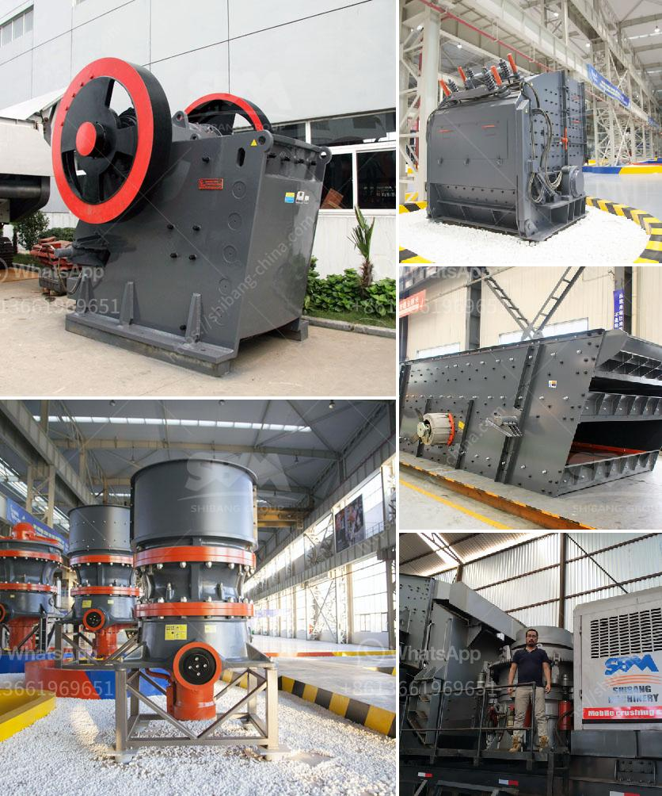

<h3>talc powder production</h3>
Talc is a naturally occurring mineral that is widely used in various industries due to its versatility and unique properties. Talc powder, also known as talcum powder, is produced by crushing, grinding, and processing talc rocks. Mining operations, processing, and manufacturing of talc powder require the use of several different techniques. Here, we will delve into the process of talc powder production, from mining to the final product.

Mining: Talc rocks are excavated from mines using conventional techniques. Various geological formations, most notably metamorphic rocks like serpentine, schist, and magnesite, are sources of talc. Once the ore is extracted, it is transported to a nearby processing facility for further refinement.

Crushing and Grinding: The first step in processing talc ore is breaking it into smaller pieces by using crushers. After crushing, the ore is ground to a fine powder using specialized ball mills or similar devices. The ground talc is then classified into various particle sizes through air separators or screens to obtain the desired grade and purity.

Purification: Once the talc ore is ground to the required particle size, it undergoes further purification to remove impurities. Commonly used techniques for purification include froth flotation, magnetic separation, or a combination of both. These methods separate talc from other minerals, such as tremolite, pyroxene, and quartz, which might be present in the ore. The purified talc concentrate is then subjected to additional processing steps for its transformation into talc powder.

Drying: The next step in talc powder production is drying the purified concentrate. This is usually achieved through a rotary kiln, where the talc is subjected to high temperatures to remove any residual moisture. The drying process is crucial to avoid clumping and agglomeration of the powder during subsequent handling and transport.

Particle Size Classification: After drying, the talc concentrate is further classified into different particle sizes to meet specific requirements of various industries. Industrial applications often demand different grades of talc based on particle size distribution. Air classifiers or sieving machines are commonly used to separate talc powder into different size fractions.

Packaging and Quality Control: The final step in talc powder production involves packaging the powder into bags or containers and conducting rigorous quality control tests. Quality control measures are necessary to ensure the powder meets the desired specifications in terms of purity, particle size distribution, and absence of contaminants. This is particularly crucial for industries such as pharmaceuticals, cosmetics, and food, where strict regulations and standards are in place.

Talc powder production is a complex and meticulous process that demands careful attention to detail at each stage. From mining and crushing to drying and classification, several steps are involved in transforming talc rocks into a fine powder suitable for various applications. The versatility, softness, and absorbency of talc powder make it an essential ingredient in numerous products, ranging from personal care items like talcum powder and makeup, to industrial uses such as paper production and ceramics manufacturing. The comprehensive understanding of the talc production process ensures the delivery of high-quality talc powder to industries worldwide.
<h3>Contact us</h3><ul><li><strong>Whatsapp:&nbsp;<a href="https://wa.me/8613661969651">+8613661969651</a></strong></li><li><a href="https://swt.shibang-china.com/?git&amp;zhl&amp;talc powder production"><strong>Online Service(chat now)</strong></a></li></ul><h3>Related</h3><ul><li><a href='x36 double roller crusher used.md'>x36 double roller crusher used</a></li><li><a href='gypsum ball mill manufacturing machine.md'>gypsum ball mill manufacturing machine</a></li><li><a href='small scale gold processing line.md'>small scale gold processing line</a></li><li><a href='portable portable hammer mill.md'>portable portable hammer mill</a></li><li><a href='granite crusher cost.md'>granite crusher cost</a></li></ul>