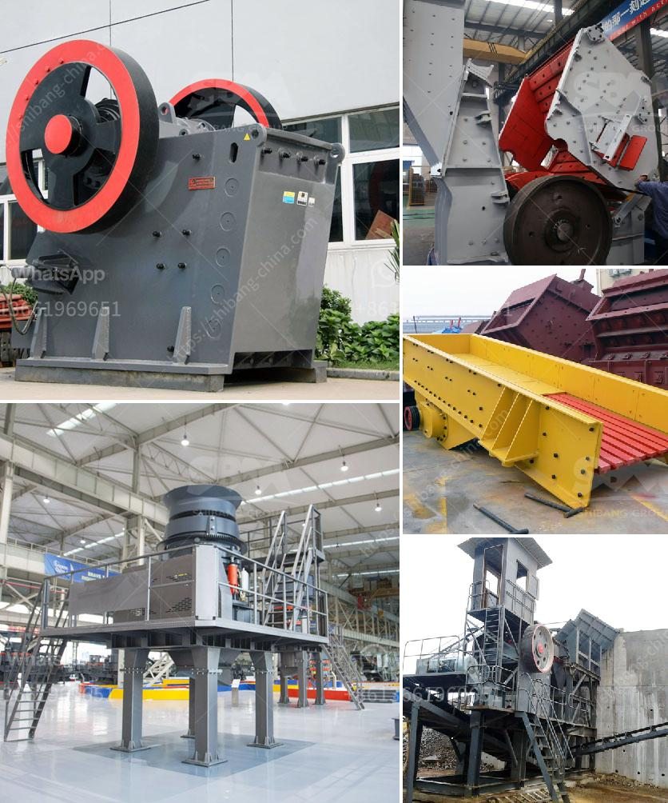

<h3>talcum powder suppliers factories</h3>
Talcum powder is a commonly used cosmetic product that has been on the market for years. It is primarily used to keep the skin dry and prevent chafing or irritation. While it may seem like a simple product, the process of manufacturing talcum powder involves several steps and requires the involvement of talcum powder suppliers factories.

Talcum powder, also known as talc or baby powder, is derived from a naturally occurring mineral called talc. This mineral is composed primarily of magnesium, silicon, and oxygen. It is finely ground into a powder form to create talcum powder. The mining of talc itself is an extensive process, involving the extraction of the mineral from deposits found deep within the earth.

Once the raw talc is extracted, it is then taken to talcum powder suppliers factories for further processing. The first step in the manufacturing process is the purification of talc. This involves removing any impurities or contaminants from the raw material. This purification process ensures that the final product is safe for use on the skin.

After purification, the talc undergoes a grinding process, in which it is crushed into a fine powder. This helps to create a smooth and silky texture that is pleasant to the touch. Grinding the talc also improves its absorbency, making it more effective as a moisture-absorbing and friction-reducing agent.

Once the talc has been ground, it is then mixed with other ingredients to create the final product. These ingredients may include fragrances, preservatives, and other additives. The mixture is thoroughly blended to ensure that the talc is evenly distributed throughout the powder.

After the blending process, the talcum powder is then packaged and prepared for distribution. This involves filling the powder into containers, usually plastic or cardboard bottles, and sealing them to prevent any contamination or spillage. The packaging process is carried out in a controlled environment to ensure the highest standards of hygiene.

In terms of safety, talcum powder suppliers factories have a responsibility to ensure that their products are safe for use. It is essential for manufacturers to conduct thorough testing and quality control measures to ensure that the talcum powder meets all regulatory and safety requirements. This includes testing for contaminants, such as asbestos, which can be harmful if present in the product.

Overall, talcum powder suppliers factories play a crucial role in the production and distribution of talcum powder. They are responsible for transforming raw talc into a safe and effective cosmetic product. Through various processes, including purification, grinding, and blending, the talcum powder is crafted to enhance its performance and texture. Additionally, these factories must adhere to strict quality control and safety standards to ensure that consumers can confidently use their products without any harm.
<h3>Contact us</h3><ul><li><strong>Whatsapp:&nbsp;<a href="https://wa.me/8613661969651">+8613661969651</a></strong></li><li><a href="https://swt.shibang-china.com/?git&amp;zhl&amp;talcum powder suppliers factories"><strong>Online Service(chat now)</strong></a></li></ul><h3>Related</h3><ul><li><a href='dolomite crushing machine for sale dubai.md'>dolomite crushing machine for sale dubai</a></li><li><a href='mobile stone crusher 120 tph price.md'>mobile stone crusher 120 tph price</a></li><li><a href='pulverizer machines manufacturers.md'>pulverizer machines manufacturers</a></li><li><a href='power of a roller mill.md'>power of a roller mill</a></li><li><a href='crussher stone manufacturer in south africa.md'>crussher stone manufacturer in south africa</a></li></ul>