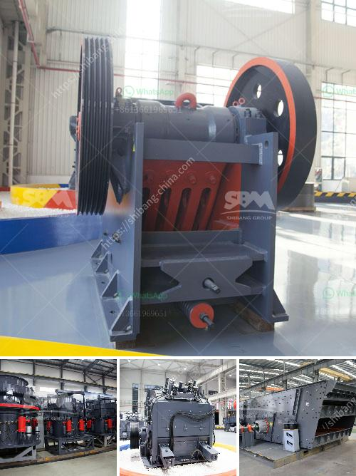

<h3>tata voltas stone crusher</h3>
Tata Voltas stone crusher signifies the collaboration between Tata Group and Voltas Limited, one of India's leading engineering, construction, and service providers. This machine embodies the spirit of Tata, blending the power of technology and innovation with a deep commitment to sustainability. With its advanced features and superior performance, Tata Voltas stone crusher has emerged as a reliable and trustworthy solution for crushing and screening needs.

Trusted Performance: Tata Voltas stone crusher is designed with robust components that ensure optimal productivity and reliability. It is equipped with a powerful engine that delivers high torque to the crushing mechanisms, enabling efficient crushing of various types of materials. The crusher's sturdy construction enhances its durability, making it suitable for operation in the harshest of environments.

Versatile Crushing: Tata Voltas stone crusher offers a wide range of applications, catering to diverse industries such as mining, construction, aggregate, and recycling. Whether it is hard rock or softer material, this crusher can handle it all. Its efficient crushing action enables the reduction of large rocks into smaller, more manageable sizes, facilitating further processing and utilization.

User-Friendly Design: Tata Voltas stone crusher boasts an ergonomic design that prioritizes operator comfort and safety. The machine is equipped with user-friendly controls and a spacious cabin that provides a clear view of the surroundings. This facilitates easy and safe operation, reducing the risk of accidents and ensuring maximum productivity.

Environmentally Conscious: Tata Voltas stone crusher takes sustainability seriously. It is engineered to minimize environmental impact through its efficient use of energy and resources. The crusher's advanced technology and intelligent features enable reduced emissions and lower fuel consumption. This not only helps in conserving natural resources but also contributes to the overall reduction of carbon footprint.

Reliable Aftersales Support: Tata Voltas stone crusher is backed by an extensive aftersales support network. Tata Group and Voltas Limited have a rich history of providing excellent customer service. With their dedicated teams of experts, they ensure prompt assistance and timely resolution of any issues that may arise. This ensures a smooth and hassle-free experience for the customers, further enhancing the overall satisfaction of owning a Tata Voltas stone crusher.

Conclusion: Tata Voltas stone crusher is a testament to the Tata Group's commitment to excellence and innovation. This machine showcases the perfect combination of cutting-edge technology, reliable performance, and environmental sustainability. With its versatility, user-friendly design, and reliable aftersales support, it stands out as a top choice for businesses operating in the crushing and screening industry.

In summary, Tata Voltas stone crusher is a game-changer in the crushing and screening arena. Its reliable performance, versatility, and commitment to sustainability make it a valuable asset for any business. By investing in Tata Voltas stone crusher, businesses can stay ahead of the competition and contribute to a greener future.
<h3>Contact us</h3><ul><li><strong>Whatsapp:&nbsp;<a href="https://wa.me/8613661969651">+8613661969651</a></strong></li><li><a href="https://swt.shibang-china.com/?git&amp;zhl&amp;tata voltas stone crusher"><strong>Online Service(chat now)</strong></a></li></ul><h3>Related</h3><ul><li><a href='prices of sand making machine.md'>prices of sand making machine</a></li><li><a href='stationary stone crushers made in china.md'>stationary stone crushers made in china</a></li><li><a href='flsmidth cement plant in egypt.md'>flsmidth cement plant in egypt</a></li><li><a href='stone crusher prices german.md'>stone crusher prices german</a></li><li><a href='10 inches marble grinding stone.md'>10 inches marble grinding stone</a></li></ul>