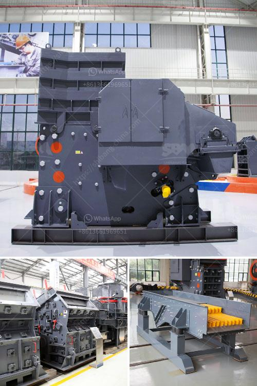

<h3>the price of stone crusher</h3>
The price of a stone crusher varies significantly depending on the type of machine and its size. There are a few different types of crushers that are used to crush stone, including jaw crushers, cone crushers, hammer crushers and impact crushers. Using compression, jaw crushers feature two "jaw-like" surfaces. Referred to as jaws, jaw crushers have a fixed jaw and a mobile jaw. To crush the stone, the jaws move together and crush the material. Cone crushers, on the other hand, are more similar to a gyratory crusher. They have a mantle that rotates around the stationary bowl, crushing the material between it and the stationary bowl. 

Stone crushing machines are used to break down a wide range of materials such as granite, basalt, limestone, concrete, etc., into smaller pieces. Crushers are designed to reduce the size of large rocks, stones, and ores. These machines are often found at quarries, mining sites, construction sites, and recycling plants.

The price range of a stone crusher machine depends on its capacity, processing capacity, power input and structural design. The higher the capacity, the higher the price. Larger machines tend to have a higher price tag, but can handle larger rocks and materials. Power input also plays a role in determining the price of a stone crusher machine.

Generally, machines with more horsepower or processing capacity are more expensive than those with lower power input. This is because more powerful machines can handle larger materials and produce more output. Structural design is another factor that affects the price of a stone crusher machine. When designing a machine, manufacturers take into account factors such as weight and durability, which can affect the machine's price.

The price of a stone crusher machine also depends on the capacity, which can range from 5 to 1,000 tons of material per hour or more. Capacity is often chosen based on the amount of material used over a specific time period, such as the requirement of a construction project. For example, a construction company may need to crush large amounts of material at a time, requiring a large capacity machine.

In terms of weathering, the price of a stone crusher machine may vary based on the level of weathering. Weathered stone crusher machine, for example, often has a lower price because of its relatively high moisture content and low hardness. On the other hand, machine-processed stone crusher has higher requirements and harder texture, so the price of machine-processed stone crusher is also higher.

The price of stone crusher directly affects its production cost. The cost of producing different types and models of stone crusher is different. Therefore, to obtain stone crusher machine with the most cost-effective production cost, manufacturers must choose their locations and select high-quality models with reliable reputation and stable performance.

In conclusion, the price of a stone crusher machine is significantly affected by factors such as the type of machine, capacity, power input, structural design, and weathering. Choosing a crusher with a reasonable price is crucial for the efficient operation of a stone crushing plant.
<h3>Contact us</h3><ul><li><strong>Whatsapp:&nbsp;<a href="https://wa.me/8613661969651">+8613661969651</a></strong></li><li><a href="https://swt.shibang-china.com/?git&amp;zhl&amp;the price of stone crusher"><strong>Online Service(chat now)</strong></a></li></ul><h3>Related</h3><ul><li><a href='stone crusher small for quarry project.md'>stone crusher small for quarry project</a></li><li><a href='portable jaw crusher in saudi.md'>portable jaw crusher in saudi</a></li><li><a href='raymond grinding mill manufacturers india.md'>raymond grinding mill manufacturers india</a></li><li><a href='pulviriser machine in allahabad.md'>pulviriser machine in allahabad</a></li><li><a href='companies crushing plant.md'>companies crushing plant</a></li></ul>