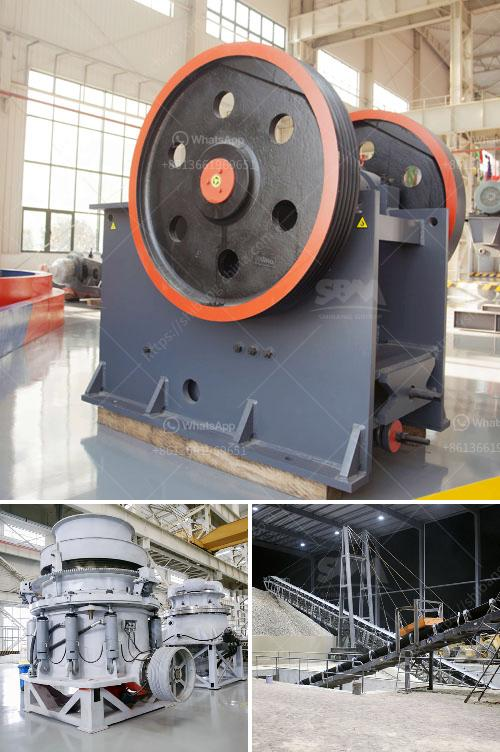

<h3>the process of cement making with ball mills</h3>
The cement industry is a fundamental part of the economy, providing essential building materials to construction sites all over the world. But the process of cement production is not straightforward. It requires a variety of machinery, including ball mills, conveyors, crushers, stackers, and reclaimers, among others.

Ball mills are arguably the most common and popular type of machinery in cement production. They work by crushing and grinding materials such as limestone, clay, iron ore, and coal, and are easily the most beloved and widely used alternative for milling raw materials in the cement industry.

The main task of a ball mill is grinding raw material into fine particles. These particles can be further used for blending, homogenizing, or producing the final end-product. The ball mill process is very complicated process governed by many parameters, such as ball size, ball shape, ball filling, slurry loading (with respect to ball amount), powder loading with respect to the amount of total slurry, and solid content within the slurry.

To make cement, clinker is first produced in a kiln, which heats limestone and other materials to extreme temperatures. The resulting clinker is then ground in a ball mill, which is essentially a large rotating drum. The ball mill functions by rotating on a horizontal axis, allowing the material to be mixed and continuously crushed.

Within the drum, the grinding media (balls) collide with each other and the raw material, breaking it into smaller particles. This grinding action results in fine particles called cement powder. The size of these particles depends on the speed of the mill and the size and density of the grinding media.

During the grinding process, a small amount of gypsum (often called the retarding agent) is added to control the setting time of the cement. This process, known as clinker grinding, is an essential step in the cement manufacturing process.

Ball mills are widely used in the cement industry, especially for producing Portland cement, which is a type of cement that uses lime as a basic ingredient. It is made with limestone, clay, and iron, which provide it with the characteristic gray color. Other types of cement, such as white cement, are also produced using ball mills, but with additional steps to remove impurities that may give the final product a different color.

In conclusion, ball mills are important machinery in the cement industry. They play a crucial role in the grinding and milling process, providing the required particle size reduction for the production of cement. By understanding the process and parameters involved in ball mill grinding, manufacturers can fine-tune this machinery to produce quality cement while minimizing energy consumption and maintaining a sustainable production process.
<h3>Contact us</h3><ul><li><strong>Whatsapp:&nbsp;<a href="https://wa.me/8613661969651">+8613661969651</a></strong></li><li><a href="https://swt.shibang-china.com/?git&amp;zhl&amp;the process of cement making with ball mills"><strong>Online Service(chat now)</strong></a></li></ul><h3>Related</h3><ul><li><a href='mini rock mobile jaw crusher west africa price in uk.md'>mini rock mobile jaw crusher west africa price in uk</a></li><li><a href='18 36 inch jaw crusher plant in south africa.md'>18 36 inch jaw crusher plant in south africa</a></li><li><a href='cement plant in india cement plant.md'>cement plant in india cement plant</a></li><li><a href='price of ballast crusher per ton in kenya.md'>price of ballast crusher per ton in kenya</a></li><li><a href='iron ore grinding ball mill details.md'>iron ore grinding ball mill details</a></li></ul>