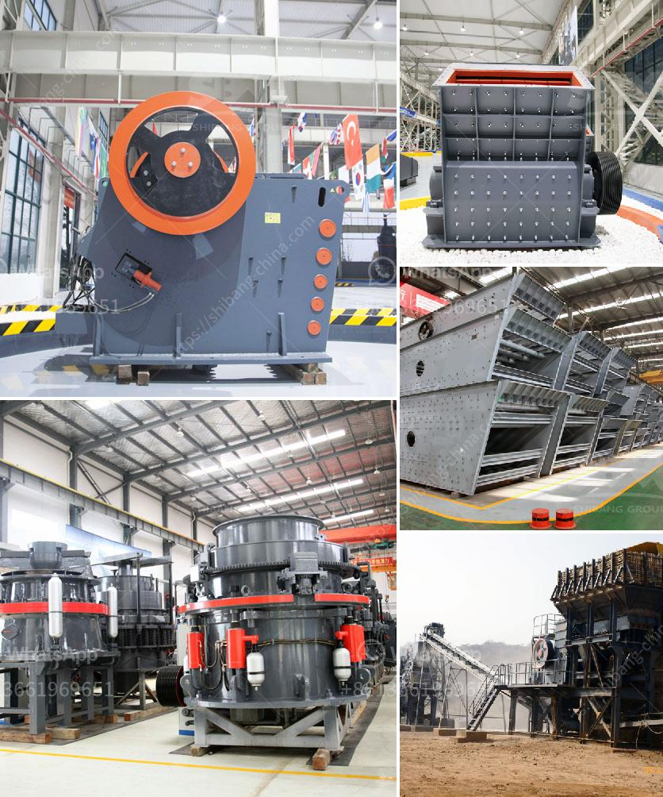

<h3>three quarter stone machine</h3>
In the ever-evolving world of construction, new technologies and machines constantly emerge to make processes more efficient and effective. One such groundbreaking tool that has taken the industry by storm is the three quarter stone machine. This innovative machine has revolutionized the way stone is crushed and used in construction projects, providing numerous benefits that were previously unimaginable.

The three quarter stone machine is a heavy-duty crusher that utilizes a high-powered hydraulic system to convert large rocks into smaller, more manageable sizes. Its primary purpose is to crush stones to a precise three-quarter inch size, making them suitable for various applications such as road construction, landscaping, and building foundations.

One of the most significant advantages of the three quarter stone machine is its exceptional productivity. Unlike traditional stone crushing methods that require manual labor and multiple machines, this automated machine can crush rocks at an astonishing rate. With its advanced crushing mechanism, it can process up to hundreds of tons of stones per hour, significantly reducing construction time and costs.

Additionally, the three quarter stone machine offers unparalleled precision in stone crushing. Its state-of-the-art technology ensures that the stones are crushed to the exact three-quarter inch size required, leaving no room for error. This level of precision enhances the quality of construction projects by ensuring uniformity in the crushed stones, thus providing a solid foundation for roads, buildings, and other structures.

Furthermore, the three quarter stone machine promotes sustainability in the construction industry. By recycling and reusing stones from demolition sites or natural resources, it minimizes the need for quarrying new stones, which can have detrimental environmental impacts. Additionally, the compact design of the machine allows for easy transportation between sites, reducing the carbon footprint associated with the movement of materials.

Moreover, the versatility of the three quarter stone machine is remarkable. Its ability to produce uniform three-quarter inch stones makes it ideal for a wide range of construction applications. Whether it is constructing driveways, patios, or walkways, or even as a base for asphalt or concrete roads, this machine can deliver consistently-sized stones that meet the specific requirements of each project.

Notably, the three quarter stone machine also enhances worker safety. By automating the stone crushing process, it eliminates the need for manual labor and minimizes the risk of injuries associated with traditional stone crushing methods. Workers can now operate the machine remotely, ensuring their safety while maintaining productivity levels.

In conclusion, the advent of the three quarter stone machine has transformed the construction industry. Its exceptional productivity, precision, sustainability, versatility, and improved worker safety have made it an indispensable tool in modern construction projects. As the demand for more efficient and sustainable construction methods continues to rise, the three quarter stone machine stands as a testament to the ingenuity and innovation that drive the industry forward.
<h3>Contact us</h3><ul><li><strong>Whatsapp:&nbsp;<a href="https://wa.me/8613661969651">+8613661969651</a></strong></li><li><a href="https://swt.shibang-china.com/?git&amp;zhl&amp;three quarter stone machine"><strong>Online Service(chat now)</strong></a></li></ul><h3>Related</h3><ul><li><a href='graphite production line.md'>graphite production line</a></li><li><a href='services nigeria conveyor machine.md'>services nigeria conveyor machine</a></li><li><a href='iron ore crusher in mexico.md'>iron ore crusher in mexico</a></li><li><a href='grinding mill gold ore.md'>grinding mill gold ore</a></li><li><a href='stone crasher busness plan pdf.md'>stone crasher busness plan pdf</a></li></ul>