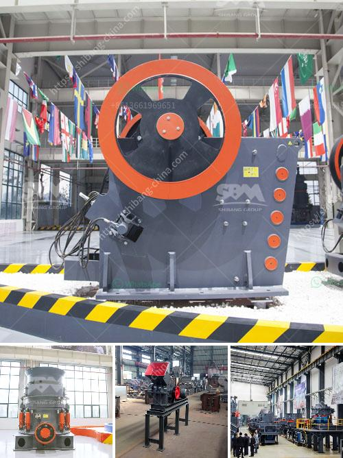

<h3>three roll milling italy</h3>
Italy has always been at the forefront of innovation and technological advancements, offering the world incredible creations in art, fashion, and design. Among its many contributions, Italy has also been a pioneer in the field of three roll milling, a process that has revolutionized various industries.

Three roll milling is a technique used to homogenize, disperse, and distribute particles uniformly in a mixture. It involves passing the mixture between three rotating rollers that apply high shear forces. The rollers can be adjusted to different gaps, enabling precise control over the milling process and resulting in highly customizable products.

Italy's involvement in three roll milling can be traced back to the early 20th century when a handful of companies recognized the potential of this technique. Over the years, their expertise and dedication have helped establish Italy as a leading player in the field, renowned for producing reliable, high-quality three roll mills.

One of the key reasons for the success of three roll milling in Italy is the emphasis on craftsmanship and attention to detail. Italian manufacturers focus on the meticulous design and construction of their mills, incorporating the finest materials and utilizing state-of-the-art manufacturing techniques. This commitment to excellence ensures that the mills deliver superior performance, durability, and precision.

The applications of three roll milling are diverse, and Italy has excelled in catering to various sectors. In the food industry, three roll mills are used to produce smooth, uniform dispersions of ingredients, enhancing the texture and taste of products such as sauces, creams, and fillings. The cosmetic industry benefits from the ability of three roll mills to produce finely milled pigments and dyes, leading to vibrant and long-lasting makeup products. Additionally, three roll milling plays a crucial role in the pharmaceutical industry, enabling the production of stable emulsions and reducing the particle size of active ingredients for improved drug delivery systems.

Italian three roll mill manufacturers stand out not only for their technical prowess but also for their commitment to customer satisfaction. These companies prioritize building strong relationships with their clients, offering comprehensive support, including technical assistance, spare parts availability, and maintenance services. This dedication has earned them a sterling reputation worldwide, making Italy a go-to destination for acquiring high-quality three roll mills.

In recent years, Italian three roll mill manufacturers have expanded their reach by embracing digitalization and automation. They have integrated cutting-edge technologies into their mills, allowing for real-time monitoring of process parameters and enhanced control over production. This innovative approach further strengthens Italy's position as a leader in the three roll milling industry and drives continuous improvement in product quality and performance.

As we look to the future, Italian manufacturers are committed to further research and development in three roll milling. Their aim is to not only refine existing technologies but also explore new applications and possibilities for this versatile technique. By continuously challenging their boundaries, Italy will undoubtedly continue to make significant contributions to the global three roll milling landscape.

In conclusion, three roll milling in Italy remains a time-honored tradition of excellence. With its unmatched craftsmanship, attention to detail, and commitment to customer satisfaction, Italy has firmly established itself as a frontrunner in the field. As the industry continues to evolve, Italian manufacturers will undoubtedly continue to push boundaries, setting new standards for quality, efficiency, and innovation in three roll milling.
<h3>Contact us</h3><ul><li><strong>Whatsapp:&nbsp;<a href="https://wa.me/8613661969651">+8613661969651</a></strong></li><li><a href="https://swt.shibang-china.com/?git&amp;zhl&amp;three roll milling italy"><strong>Online Service(chat now)</strong></a></li></ul><h3>Related</h3><ul><li><a href='granite crushers machine from germany.md'>granite crushers machine from germany</a></li><li><a href='jaw crusher powder malaysia.md'>jaw crusher powder malaysia</a></li><li><a href='manganese ore processing machine price.md'>manganese ore processing machine price</a></li><li><a href='hpc cone crusher.md'>hpc cone crusher</a></li><li><a href='manufacturing process of portland slag cement.md'>manufacturing process of portland slag cement</a></li></ul>