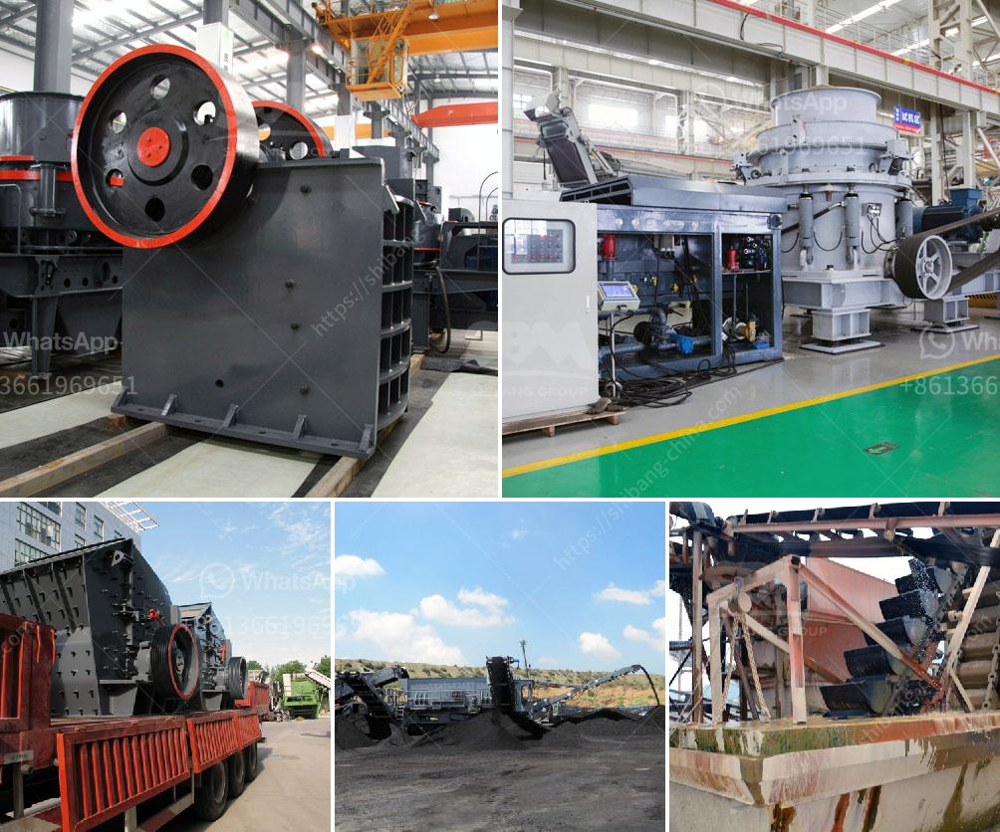

<h3>three roller raymond mill</h3>
The three-roller Raymond mill is an essential grinding equipment in the field of mineral processing. It is widely used in various industries such as mining, cement, metallurgy, chemical industry, and refractory materials. It can be used for fine grinding of various non-flammable and non-explosive materials with Mohs hardness below 7 and humidity below 6%.

The three-roller Raymond mill consists of a host machine, a fan, a separator, a pipeline device, a blower, a finished cyclone, a jaw crusher, a bucket elevator, an electromagnetic vibrating feeder, and an electric control motor. The quincunx stand on the top of the Raymond mill contains a motor that drives the grinding table, allowing the grinding rollers to rotate in the ring. The grinding roller assembly is hung on the star rack of the central main machine through the blade frame, and the rotation around its own axis is driven by the rotating disc device.

What sets the three-roller Raymond mill apart from other grinding mills is its unique working principle. The material to be ground is evenly and continuously sent to the grinding chamber through the electromagnetic vibrating feeder. The machine revolves around the central axis while rotating on its own axis. The grinding roller assembly constantly rolls and grinds the materials during the rotation process, and the ground material is brought into the analysis machine through the air inlet. The fine powder, after passing through the analysis machine, reaches the cyclone separator and is discharged through the discharge pipe, while the coarse material falls back to the grinding chamber for regrinding.

One of the key advantages of the three-roller Raymond mill is its high efficiency and low energy consumption. Compared with the traditional Raymond mill, it can increase production by more than 40%. The unit power consumption cost of the mill can be saved by more than 30%. Moreover, the equipment has a small footprint, making it easy to install and maintain. The unique design of the three rollers ensures a stable and uniform grinding effect, effectively reducing the generation of fine powder and increasing the utilization of materials.

In terms of product quality, the three-roller Raymond mill adopts advanced structure and technology, ensuring the uniformity and fineness of the finished product. The fineness of the grinding product can be adjusted between 80-400 mesh, and the fineness can be controlled and separated by the adoptive technology of closed-circuit system. This ensures the product size is consistent and meets the demand of various industries.

In conclusion, the three-roller Raymond mill is an excellent grinding equipment that delivers high efficiency, low energy consumption, and high product quality. It is an indispensable tool for industries involved in the processing of non-flammable and non-explosive materials. With continuous development and improvement, the three-roller Raymond mill will continue to shine in the field of grinding equipment.
<h3>Contact us</h3><ul><li><strong>Whatsapp:&nbsp;<a href="https://wa.me/8613661969651">+8613661969651</a></strong></li><li><a href="https://swt.shibang-china.com/?git&amp;zhl&amp;three roller raymond mill"><strong>Online Service(chat now)</strong></a></li></ul><h3>Related</h3><ul><li><a href='sand making machine cost.md'>sand making machine cost</a></li><li><a href='hpc cone crusher.md'>hpc cone crusher</a></li><li><a href='coal mill outlet temperature.md'>coal mill outlet temperature</a></li><li><a href='manufacturing process of talcum powder.md'>manufacturing process of talcum powder</a></li><li><a href='gypsum production machinery.md'>gypsum production machinery</a></li></ul>