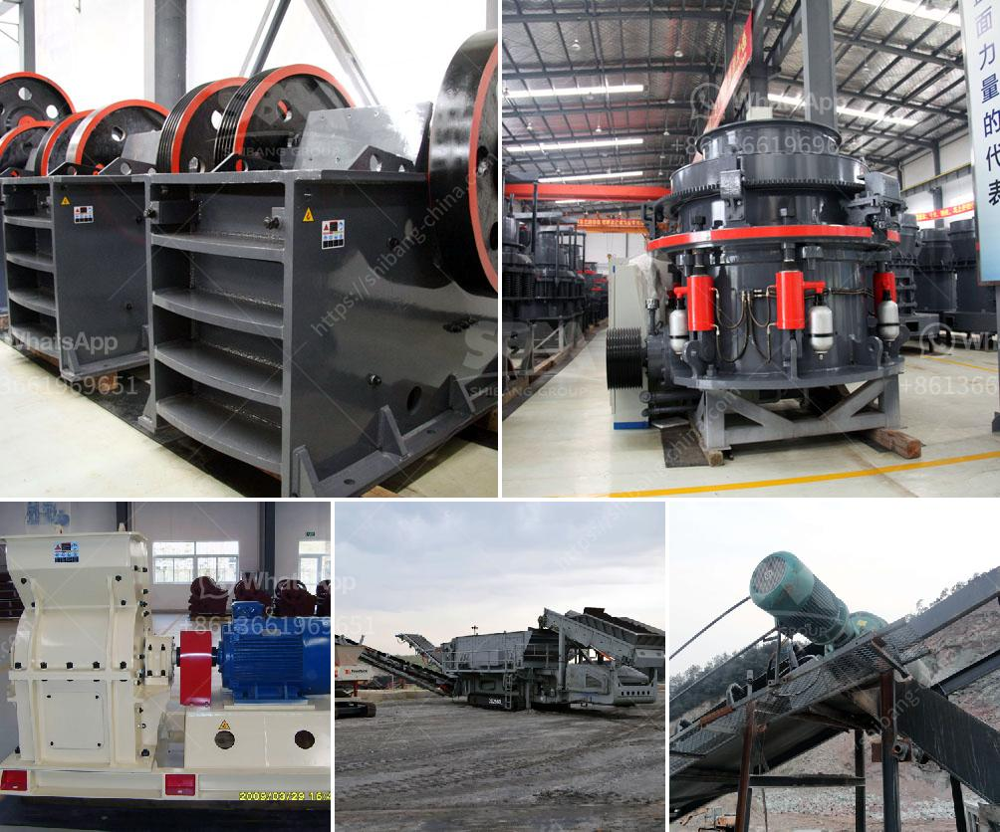

<h3>to calculate cost of limestone production in mining</h3>
Limestone is a sedimentary rock composed mainly of calcium carbonate (CaCO3). However, it can also contain magnesium carbonate, clay, iron carbonate, feldspar, pyrite, and quartz in minor quantities, according to the Encyclopedia Britannica. Most limestone is extracted through blasting, drilling, and crushing.

The cost of limestone production is determined by the expenses associated with extracting it from the ground and processing it into various sizes and shapes for different uses. In mining operations, the costs are divided into two categories:

   - Extraction costs: These include the expenses related to blasting and drilling in the quarry to remove the limestone from its natural state.

   - Loading and hauling costs: Once the limestone is extracted, it needs to be transported to the processing plant. This involves using specialized machinery and trucks, which incur additional expenses.

   - Crushing and screening costs: After the limestone is transported to the processing plant, it is crushed and screened into different sizes for various applications, such as construction materials, agricultural lime, and cement production. These processes require specific equipment and operators, which contribute to the overall production cost.

   - Maintenance costs: Machinery used in the extraction and processing of limestone needs regular maintenance, including repairs and replacements of parts. These overhead expenses add to the cost of production.

   - Labor costs: Skilled labor is required to operate the machinery and equipment and ensure a smooth production flow. The wages and benefits paid to the employees are part of the overall cost.

   - Administrative expenses: Management, accounting, and other administrative costs associated with running the mining operation are included in the calculation.

To calculate the cost of limestone production in mining, operators should consider the following factors:

By analyzing these factors, operators can decide on the most efficient and cost-effective methods of extracting and processing limestone. This information is invaluable for creating accurate cost estimates, optimizing production processes, and maximizing profitability in the limestone mining industry.
<h3>Contact us</h3><ul><li><strong>Whatsapp:&nbsp;<a href="https://wa.me/8613661969651">+8613661969651</a></strong></li><li><a href="https://swt.shibang-china.com/?git&amp;zhl&amp;to calculate cost of limestone production in mining"><strong>Online Service(chat now)</strong></a></li></ul><h3>Related</h3><ul><li><a href='cobalt concentrate processing equiopment manufacturers.md'>cobalt concentrate processing equiopment manufacturers</a></li><li><a href='price jaw crusher price stone crusher.md'>price jaw crusher price stone crusher</a></li><li><a href='project report on concrete crusher pdf.md'>project report on concrete crusher pdf</a></li><li><a href='ball mill cement grinding.md'>ball mill cement grinding</a></li><li><a href='size of ball mill with cspacity 280 tph.md'>size of ball mill with cspacity 280 tph</a></li></ul>