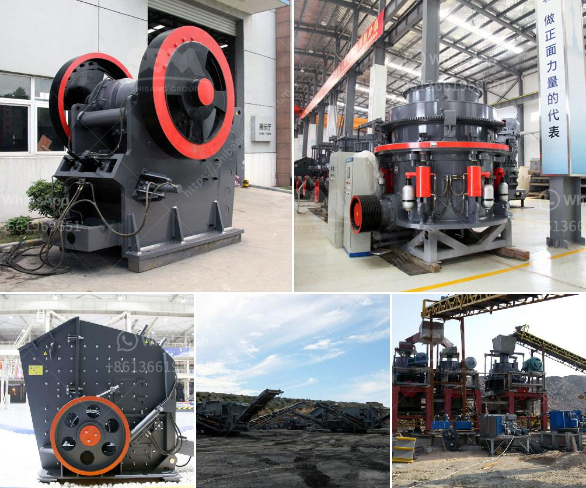

<h3>to choose jaw crusher</h3>
When choosing a jaw crusher, it is important to consider several factors before making any decision. Firstly, the type of rock and its hardness, as well as the final product size required, will determine what jaw crusher to choose. Additionally, the economy of crushing and screening processes will also influence the choice in terms of production capacity, maintenance, and operational costs.

One of the key considerations is the crusher's raw material capability. You need to ensure that the crusher can handle the type of material you will be feeding into it. Jaw crushers are versatile and suitable for handling various types of materials, ranging from hard stone to recycled materials. For this reason, they are widely used in various industries, including mining, quarrying, construction, and recycling.

The next factor to consider is the compression strength of the materials being crushed. The jaw crusher is designed to crush materials with a compressive strength up to 320 MPa. This makes it suitable for a wide range of applications, including mining, quarrying, and recycling.

It is also important to consider the final product size required. Jaw crushers are versatile machines that can produce different sizes of crushed materials, depending on the specific model and settings. However, it is important to note that the finer the final product size, the higher the operational costs. Therefore, it is essential to strike a balance between the desired product size and the cost of production.

Another key consideration is the capacity requirements. Jaw crushers come in different sizes and models, each with a specific maximum capacity. It is crucial to select a crusher that can handle the anticipated volume of material. Exceeding the crusher's capacity can result in reduced production output, increased wear, and additional maintenance costs. On the other hand, choosing a crusher with a higher capacity than needed can be wasteful in terms of both capital and operational costs.

The overall design and durability of the jaw crusher are also important considerations. Look for a crusher that features a robust construction and high-quality components to ensure long-lasting performance. A well-designed crusher will also make maintenance tasks easier, reducing downtime and overall operational costs.

Lastly, it is recommended to seek advice from experienced professionals when choosing a jaw crusher. Working with experts in the field will provide valuable insights and help you choose the right crusher for your specific application. They can assess your needs, analyze your operations, and recommend the most suitable crusher for your requirements.

In conclusion, choosing the right jaw crusher is a critical decision that will have a significant impact on your operations. Consider factors such as raw material capability, compression strength, desired product size, capacity requirements, design, and durability. Seek advice from industry professionals to ensure you make the best choice possible. By carefully evaluating these factors, you can select a jaw crusher that will deliver optimal performance, productivity, and cost-efficiency for your operations.
<h3>Contact us</h3><ul><li><strong>Whatsapp:&nbsp;<a href="https://wa.me/8613661969651">+8613661969651</a></strong></li><li><a href="https://swt.shibang-china.com/?git&amp;zhl&amp;to choose jaw crusher"><strong>Online Service(chat now)</strong></a></li></ul><h3>Related</h3><ul><li><a href='tracked jaw crusher for sale.md'>tracked jaw crusher for sale</a></li><li><a href='gold mining equipment company in japan.md'>gold mining equipment company in japan</a></li><li><a href='kenya cement plant.md'>kenya cement plant</a></li><li><a href='calcite processing equipment.md'>calcite processing equipment</a></li><li><a href='ball mill cement grinding.md'>ball mill cement grinding</a></li></ul>