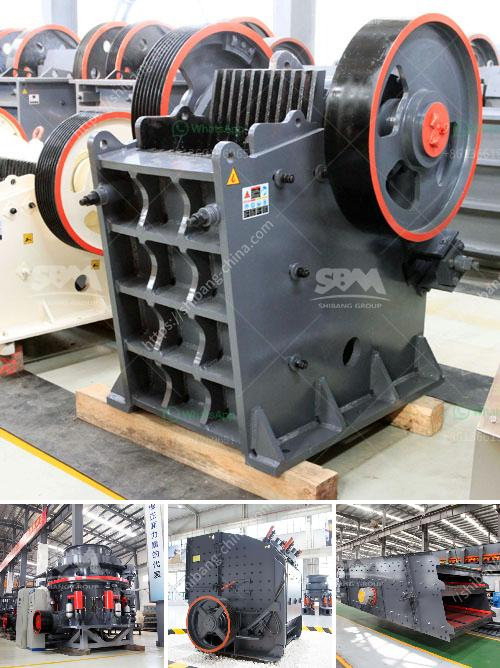

<h3>to do with the stone crusher</h3>
The stone crusher is a piece of indispensable equipment for the stone crushing line, Which can be used for primary, secondary and fine crushing of more than 200 kinds of rough stones such as granite, basalt, limestone, rock, concrete, aggregate, gravel, dolomite and quartz.

The stone crusher not only enhances crushing efficiency and energy-saving, but also expands the scope of application. It is characterized by reliable performance, easy maintenance, robust construction, and low operation cost, making it popular among the clients.

The stone crusher is equipped with a high-quality equipment that can evenly and continuously transmit feeding material to the crushing mechanism through the hopper. Its large feed inlet allows it to handle rock of different sizes to achieve efficient crushing. This machine also adopts advanced crushing technology, making sure that it can process various rocks and stones with different hardness levels.

The stone crusher works on the principle of squeezing the rock between the fingers and splitting the rock into smaller particles. This process reduces the feed material into more manageable sizes, making it easier for further processing. It is widely used in various industries, such as mining, cement, construction, metallurgy, and chemical industries.

As a result of its excellent performance and reliable operation, the stone crusher has become the preferred choice for many construction projects and mining operations. It can significantly improve the overall production efficiency and enhance the quality of the final product.

In conclusion, the stone crusher is essential equipment in the stone crushing line. Its performance and reliability have been proven over the years, making it indispensable in various industries. With the advancement of technology, the stone crusher will continue to evolve and meet the demands of different customers, making it an indispensable tool in the construction and mining industries.
<h3>Contact us</h3><ul><li><strong>Whatsapp:&nbsp;<a href="https://wa.me/8613661969651">+8613661969651</a></strong></li><li><a href="https://swt.shibang-china.com/?git&amp;zhl&amp;to do with the stone crusher"><strong>Online Service(chat now)</strong></a></li></ul><h3>Related</h3><ul><li><a href='used grinding mills for sale.md'>used grinding mills for sale</a></li><li><a href='second hand mobile coal washing plant.md'>second hand mobile coal washing plant</a></li><li><a href='difference between raymond mill and ball mill.md'>difference between raymond mill and ball mill</a></li><li><a href='ball mill to grind quartz.md'>ball mill to grind quartz</a></li><li><a href='pebble crushing production line.md'>pebble crushing production line</a></li></ul>