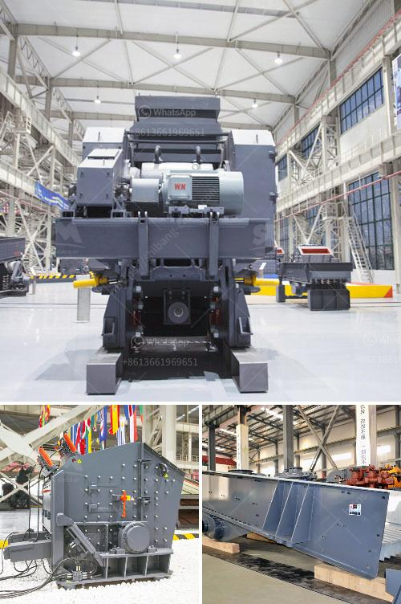

<h3>toggle jaw crusher</h3>
The toggle jaw crusher is a heavy-duty machine that is commonly used for crushing different kinds of raw materials. It efficiently crushes the toughest materials, including stones and metals, making it an ideal choice for industries such as mining, quarrying, and recycling.

The toggle jaw crusher operates using a swinging motion. This motion is achieved by the vertical movement of the pitman, which moves up and down as the eccentric shaft rotates. The swinging motion of the jaws compresses the material against the fixed jaw, crushing it into smaller pieces.

One of the key features of the toggle jaw crusher is its adjustable jaw setting. This allows you to control the size of the material being crushed, which is crucial for different applications. For example, if you are crushing large rocks, you can adjust the jaw setting to produce smaller sized stones. On the other hand, if you are crushing metals for recycling, you can adjust the jaw setting to produce larger pieces that can be easily sorted.

The robust construction of the toggle jaw crusher ensures high efficiency and durability. It is built to withstand heavy-duty operations and has a long lifespan. Additionally, it has a simple design, which makes maintenance and repairs easy.

Another advantage of the toggle jaw crusher is its versatility. It can be used for both primary and secondary crushing applications. This means that you can use it to crush initial raw materials, as well as for further processing of the crushed materials.

In conclusion, the toggle jaw crusher is a reliable machine that is widely used in the mining, quarrying, and recycling industries. It offers great efficiency, durability, and versatility, making it a valuable asset for any business. Whether you are crushing stones or recycling metals, the toggle jaw crusher is the ideal choice for your crushing needs.
<h3>Contact us</h3><ul><li><strong>Whatsapp:&nbsp;<a href="https://wa.me/8613661969651">+8613661969651</a></strong></li><li><a href="https://swt.shibang-china.com/?git&amp;zhl&amp;toggle jaw crusher"><strong>Online Service(chat now)</strong></a></li></ul><h3>Related</h3><ul><li><a href='machine price list ball mill for silica sand.md'>machine price list ball mill for silica sand</a></li><li><a href='manufacture of a cone crusher.md'>manufacture of a cone crusher</a></li><li><a href='conveyor belts enginners in south africa.md'>conveyor belts enginners in south africa</a></li><li><a href='used cone crusher for sale ton per hour.md'>used cone crusher for sale ton per hour</a></li><li><a href='ball mill in hindi.md'>ball mill in hindi</a></li></ul>