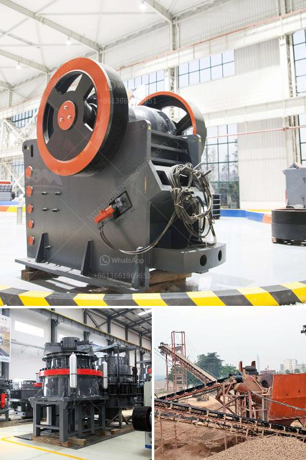

<h3>ton per hour coal crushing plant</h3>
Coal is an essential fuel for electricity production worldwide. The importance of coal in powering various industries cannot be understated. In order to meet the ever-increasing global energy demands, coal needs to be processed efficiently and in large quantities. This is where a ton per hour coal crushing plant comes into play. With advanced technologies, such a plant can maximize productivity and ensure a steady supply of coal to power plants.

A ton per hour coal crushing plant efficiently crushes raw coal to a specific size to meet the boiler requirements. When coal is mined, it undergoes several processes such as removing impurities and reducing the size of coal for efficient combustion. Crushing coal to a specific size ensures enhanced efficiency of the boiler, resulting in reduced emissions and improved overall performance.

To guarantee the best performance, a ton per hour coal crushing plant employs advanced technologies. Various crushing machines such as jaw crushers, impact crushers, and cone crushers break coal into smaller sizes. Additionally, screens and conveyors help separate coal particles and transport them to different storage areas. This seamless process ensures a continuous supply of crushed coal and maximizes plant efficiency.

Automation and control systems play a crucial role in the functionality and efficiency of a coal crushing plant. With these systems, the process becomes more streamlined, reducing the need for manual intervention and minimizing the chances of errors. The automation systems monitor and regulate the crushing process, ensuring consistent output and minimizing downtime. By adjusting variables such as feed rates and crusher settings, the crushing plant can maintain a constant feed to the boiler, ensuring a reliable supply of energy.

In addition to improving efficiency, a ton per hour coal crushing plant focuses on reducing its environmental impact. Advanced dust suppression systems prevent the escape of harmful coal dust, thereby reducing air pollution. Water sprays effectively control dust during the crushing process, protecting workers' health and ensuring compliance with environmental regulations.

A ton per hour coal crushing plant plays a vital role in preparing coal for use and meeting global energy demands. By embracing advanced technologies and automation, such a plant ensures maximum productivity, efficiency, and safety. With a constant supply of crushed coal to power plants, the energy industry can continue to thrive, meeting the needs of societies around the world while minimizing environmental impact. It is undeniable that a ton per hour coal crushing plant is crucial for the success of the coal industry and the generations to come.
<h3>Contact us</h3><ul><li><strong>Whatsapp:&nbsp;<a href="https://wa.me/8613661969651">+8613661969651</a></strong></li><li><a href="https://swt.shibang-china.com/?git&amp;zhl&amp;ton per hour coal crushing plant"><strong>Online Service(chat now)</strong></a></li></ul><h3>Related</h3><ul><li><a href='stone crusher equipment for sale.md'>stone crusher equipment for sale</a></li><li><a href='hammer mill sale in malaysia.md'>hammer mill sale in malaysia</a></li><li><a href='calcium carbonate proses by process.md'>calcium carbonate proses by process</a></li><li><a href='flsmidth cement plant in egypt.md'>flsmidth cement plant in egypt</a></li><li><a href='company in japan dealing in portable crusher machine.md'>company in japan dealing in portable crusher machine</a></li></ul>