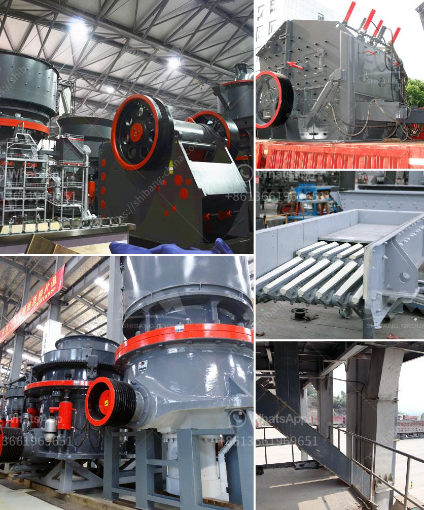

<h3>tons per hour cement grinding plant</h3>
In the world of cement manufacturing, the grinding process is extremely crucial. As the final stage in cement production, it determines the quality and durability of the finished product. With technological advancements, cement grinding plants are now equipped with efficient equipment that can grind cement clinker into fine powder at an impressive rate. One example of such a plant is the tons per hour cement grinding plant.

A tons per hour cement grinding plant is designed to grind cement clinker and other additives into fine powder at a specific throughput capacity. This plant can operate 24/7, continuously, all year round, providing a reliable and consistent supply of cement. With the latest grinding technology, the plant can achieve an hourly output of 300 to 500 tons of cement, depending on the desired fineness of the end product.

Efficiency is a key factor in cement grinding plants, as the process requires substantial energy and accounts for a significant portion of the total production cost. To maximize efficiency, tons per hour cement grinding plants are equipped with advanced features that optimize the energy consumption and wear of the grinding equipment. These plants use efficient separators and grinding aids to reduce the energy required for grinding, resulting in lower power consumption per ton of cement produced.

Additionally, the design of the plant ensures smooth operation and minimal downtime. High-quality grinding mills and rollers are used to withstand the intense pressure and temperature inside the grinding chamber. Special sealing systems and lubrication mechanisms are implemented to guarantee the longevity and reliability of the equipment.

Moreover, automation plays a crucial role in maximizing the performance of tons per hour cement grinding plants. Automated control systems monitor and adjust the grinding parameters in real time, ensuring optimal grinding efficiency and product quality. Online analyzers continuously measure the fineness and chemical composition of the ground cement, allowing for immediate adjustments to maintain the desired quality standards.

Furthermore, environmental concerns are considered in the design of tons per hour cement grinding plants. Dust collectors and filters are installed to capture and control the emissions generated during the grinding process, ensuring compliance with environmental regulations. Waste heat recovery systems are also installed to utilize the excess heat from the process, reducing energy consumption and lowering greenhouse gas emissions.

In conclusion, a tons per hour cement grinding plant offers enhanced efficiency and productivity for cement manufacturers. With advanced technology and automation, these plants are capable of grinding large quantities of cement at a rapid pace while minimizing energy consumption and maximizing product quality. By investing in a tons per hour cement grinding plant, manufacturers can improve their competitiveness, reduce production costs, and meet the growing demand for high-quality cement.
<h3>Contact us</h3><ul><li><strong>Whatsapp:&nbsp;<a href="https://wa.me/8613661969651">+8613661969651</a></strong></li><li><a href="https://swt.shibang-china.com/?git&amp;zhl&amp;tons per hour cement grinding plant"><strong>Online Service(chat now)</strong></a></li></ul><h3>Related</h3><ul><li><a href='ball grinding mill.md'>ball grinding mill</a></li><li><a href='ball mills for grinding lime.md'>ball mills for grinding lime</a></li><li><a href='gold mining equipment manufacturers in europe.md'>gold mining equipment manufacturers in europe</a></li><li><a href='quartz stone crushing process.md'>quartz stone crushing process</a></li><li><a href='cement clinker grinding equipmenttpd.md'>cement clinker grinding equipmenttpd</a></li></ul>