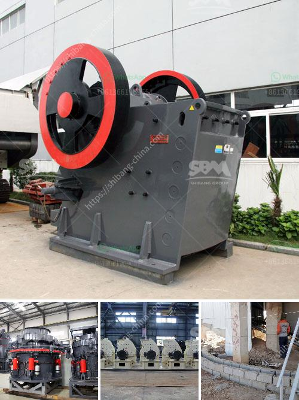

<h3>tons per hour mobile crushers</h3>
Mobile crushers, also known as mobile crushing plants, are uniquely designed to help rock and ore processing facilities meet industry demands in terms of mobility and versatility. These crushers consist of movable modules and can be shifted to follow the mine face or relocated in a quarry, allowing miners and construction companies to crush materials directly at the site of extraction or excavation. With their ability to crush a wide range of materials, mobile crushers are at the forefront of essential equipment for mining, quarrying, and construction projects. 

Tons per hour mobile crushers are specifically designed for large-scale operators, truck haulage is costly and requires a significant amount of planning. Utilizing a mobile crusher, on the other hand, allows for easy and instant deployment with minimal setup time, thus providing operators with flexible options to quickly process materials and meet production demands. 

One of the key advantages of tons per hour mobile crushers is their ability to handle various types of materials, including aggregates, concrete, asphalt, glass, coal, natural stone, and even reinforced concrete. This versatility enables them to be used in a wide range of applications, such as road construction, demolition, and recycling projects. By reducing the need for multiple machines and separate crushing processes, mobile crushers streamline operations and increase efficiency at work sites.

The advanced technology incorporated into tons per hour mobile crushers ensures high productivity while maintaining low fuel consumption. The crushers are powered by diesel engines or electric motors, resulting in reduced emissions and improved energy efficiency. Additionally, the latest models are equipped with intelligent control systems to optimize performance and monitor vital operating information in real-time.

Considerable research and development have focused on enhancing the safety features of tons per hour mobile crushers. Safety is a major concern in mining, quarrying, and construction industries due to the inherent risks associated with heavy machinery and mining operations. Manufacturers have responded by incorporating advanced safety features such as automatic central lubrication, dust suppression systems, and remote monitoring capabilities. These features not only enhance worker safety but also reduce downtime and maintenance costs.

In conclusion, tons per hour mobile crushers have emerged as a vital solution for mining, quarrying, and construction projects. The ability to crush materials directly at the site of extraction or excavation eliminates the need for costly transportation and processing, saving time and reducing emissions. With their versatility and advanced technology, these mobile crushers deliver high productivity while maintaining fuel efficiency. Furthermore, the incorporation of safety features ensures worker safety and minimizes downtime. As the demand for aggregates and materials continues to rise, tons per hour mobile crushers remain crucial in meeting these ever-increasing industry demands.
<h3>Contact us</h3><ul><li><strong>Whatsapp:&nbsp;<a href="https://wa.me/8613661969651">+8613661969651</a></strong></li><li><a href="https://swt.shibang-china.com/?git&amp;zhl&amp;tons per hour mobile crushers"><strong>Online Service(chat now)</strong></a></li></ul><h3>Related</h3><ul><li><a href='gold processing per hour.md'>gold processing per hour</a></li><li><a href='coal processing plant maintenance.md'>coal processing plant maintenance</a></li><li><a href='equipment needed for quarry crusher.md'>equipment needed for quarry crusher</a></li><li><a href='chromite beneficiation plant in malaysia.md'>chromite beneficiation plant in malaysia</a></li><li><a href='small mobile crushers.md'>small mobile crushers</a></li></ul>