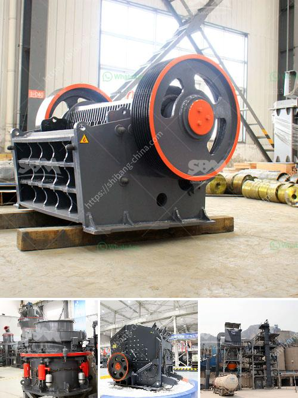

<h3>tph jaw crusher price</h3>
The jaw crusher is an essential piece of equipment when you are in the mining or construction industry. It is used extensively in heavy industry applications such as breaking huge rocks into smaller pieces. The jaw crusher is also known as the primary crusher in most crushing and screening plants. It is capable of crushing large rocks with a compressive strength of up to 320MPa.

When it comes to purchasing a jaw crusher, it is essential to consider its capacity. The capacity of a jaw crusher is determined by the size and type of the feed material. For instance, a 500x750mm jaw crusher has a maximum capacity of 300 tph. The higher the capacity, the more material the crusher can process at a time.

Another factor to consider when purchasing a jaw crusher is the price. The price is influenced by many factors such as the brand, model, and the quality of the jaw crusher. Now, as the capacity and price are interrelated, there are certain jaw crushers that have a higher capacity but are priced higher as well.

The price of a jaw crusher with a capacity of 300-500 tph is higher than that of single-jaw crushers. The reason is simple; the jaw crusher has more requirements for the material feeding during the production process, and it needs an even distribution of the feed material. So more materials need to be screened on the feeder to ensure the correct feeding of the jaw crusher. This process requires additional screening equipment, which increases the overall cost of the jaw crusher.

Additionally, the price of a jaw crusher is influenced by the configuration of the crusher. For example, a jaw crusher with a larger inlet size and a larger motor power may have a higher price. Similarly, a jaw crusher with a hydraulic adjustment system and an automatic lubricating system may be more expensive.

The brand of the jaw crusher also affects its price. Well-known and reputable brands often charge higher prices due to their brand value and quality assurance. However, it is important to note that expensive doesn't always mean better. It is crucial to research and evaluate different brands to find the one that offers the best value for your money.

In conclusion, the price of a jaw crusher with a capacity of 300-500 tph depends on many factors such as the brand, model, configuration, and quality of the crusher. As the capacity increases, the price also increases due to higher production costs. It is essential to research and compare different jaw crushers to find the best one for your needs and budget. Remember to consider the capacity, price, and quality of the jaw crusher when making a purchasing decision.
<h3>Contact us</h3><ul><li><strong>Whatsapp:&nbsp;<a href="https://wa.me/8613661969651">+8613661969651</a></strong></li><li><a href="https://swt.shibang-china.com/?git&amp;zhl&amp;tph jaw crusher price"><strong>Online Service(chat now)</strong></a></li></ul><h3>Related</h3><ul><li><a href='stone crusher 200 ton per.md'>stone crusher 200 ton per</a></li><li><a href='portable coal crusher.md'>portable coal crusher</a></li><li><a href='vertical hammer crusher.md'>vertical hammer crusher</a></li><li><a href='vibrating screen in south africa.md'>vibrating screen in south africa</a></li><li><a href='manufacturers of coal mill in india.md'>manufacturers of coal mill in india</a></li></ul>