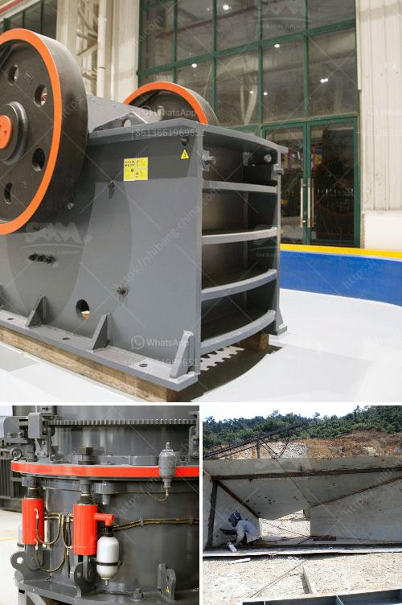

<h3>tph rock crusher</h3>
The TPH rock crusher is an advanced and high-efficiency machine developed by transforming the traditional crushing technology. This rock crusher is suitable for crushing various kinds of ores and rocks with medium over hardness and it has the features of reliable structure, high production efficiency, convenient adjustment, and economic use. The spring safety system is the overload protection device which can make the iron go through the crushing chamber without damaging the machine. It adopts two sealing means: dry oil and water to separate stone powders and lubrication grease, thus ensuring reliable performance.

The TPH rock crusher machine has a wide range of applications which can process various kinds of materials with a crushing compression strength of up to 320 MPa. It is the preferred equipment for coarse crushing of various types of rocks. In order to have a better understanding of the capabilities and characteristics of this equipment, we will provide a brief introduction to the main components of its construction.

Firstly, the motor drives the eccentric shaft to rotate through the belt pulley, making the movable jaw move back and forth. When the movable jaw approaches and leaves the fixed jaw, the materials in the crushing cavity will be squeezed, split, and bent. Finally, the crushed materials will be discharged from the lower part of the rock crusher.

The TPH rock crusher is mainly composed of a frame, an eccentric shaft, a large pulley, a flywheel, a side guard, a toggle plate, a toggle plate rear seat, a clearance adjusting screw, a return spring, a fixed jaw plate, and a movable jaw plate. It is used for primary crushing of various kinds of ores and rocks with a crushing ratio of large, deep crushing cavity, and no dead zone.

The TPH rock crusher adopts a fixed jaw plate and a movable jaw plate to form a wedge-shaped crushing chamber. The discharge port is adjusted by a threaded sleeve, which can adjust the size of the discharge port to control the size of the crushed material. The crushing chamber has deep and symmetrical crushing chamber and is made of high-manganese steel. The wearable parts have a long service life. Jaw crusher adopts a unique flywheel design to reduce vibration, which has a good damping effect on the equipment. The motor drives the belt and pulley to make the movable jaw move back and forth.

The TPH rock crusher produced by Hongxing Machinery is highly praised by customers for its excellent quality and exquisite craftsmanship. Compared with the common jaw crusher, this machine has the features of high wear resistance, reliable performance, and convenient maintenance. It has been exported to many countries and regions all over the world. It is the ideal choice for producing high-quality aggregates for highway, railway, construction, municipal engineering, hydroelectric dam construction, concrete mixing plant, and other industries.

In conclusion, the TPH rock crusher machine provided by Hongxing Machinery has a wide range of applications, superior performance, and is ideally suited for creating high-quality aggregat
<h3>Contact us</h3><ul><li><strong>Whatsapp:&nbsp;<a href="https://wa.me/8613661969651">+8613661969651</a></strong></li><li><a href="https://swt.shibang-china.com/?git&amp;zhl&amp;tph rock crusher"><strong>Online Service(chat now)</strong></a></li></ul><h3>Related</h3><ul><li><a href='marble crusher cost.md'>marble crusher cost</a></li><li><a href='companies crushing plant.md'>companies crushing plant</a></li><li><a href='lime stone pulverizer machine manufacturers.md'>lime stone pulverizer machine manufacturers</a></li><li><a href='different type of grinding mills.md'>different type of grinding mills</a></li><li><a href='to choose jaw crusher.md'>to choose jaw crusher</a></li></ul>