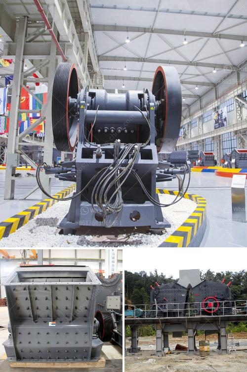

<h3>tracked jaw crusher for sale</h3>
The tracked jaw crusher, also known as a crawler jaw crusher, is highly efficient and reliable in terms of performance. It offers multiple advantages over other traditional crushing equipment. One of the key benefits is its ability to carry out on-site crushing of materials, eliminating the need for transportation and reducing the cost of materials. 

The tracked jaw crusher for sale is beneficial for various industries, including quarrying, construction, recycling, mining, and many others. It heavily relies on the use of an efficient and reliable engine, as it powers the crusher's various components, enabling it to operate smoothly. The engine ensures that the jaw crusher can handle tough materials, such as reinforced concrete or hard rock, with ease.

Furthermore, the tracked design of this crusher allows for excellent maneuverability, making it suitable for both primary and secondary crushing applications. With its compact size and ability to track into remote areas, the tracked jaw crusher can easily navigate through narrow spaces and rough terrains. This makes it a perfect choice for job sites with limited access or challenging conditions.

In terms of performance, the tracked jaw crusher offers impressive crushing capabilities. It is equipped with a large jaw opening that allows it to handle larger feed sizes. This means that it can process various types of materials, ranging from hard and abrasive to soft and sticky. It ensures high productivity and excellent reduction ratios, resulting in high-quality end products.

Furthermore, the tracked jaw crusher for sale comes with advanced features to enhance operator comfort and safety. It typically includes a user-friendly control panel that allows for easy operation of the equipment. Additionally, it may also incorporate features such as automatic lubrication systems, remote control functionality, and dust suppression systems, making it even more convenient and efficient to use.

Overall, the tracked jaw crusher for sale is a reliable and efficient piece of equipment that offers numerous benefits to the industries it serves. Its versatility, maneuverability, and performance make it an ideal choice for various applications. Whether it is used in quarrying, construction, or recycling, this crusher is sure to deliver exceptional results and maximize productivity.
<h3>Contact us</h3><ul><li><strong>Whatsapp:&nbsp;<a href="https://wa.me/8613661969651">+8613661969651</a></strong></li><li><a href="https://swt.shibang-china.com/?git&amp;zhl&amp;tracked jaw crusher for sale"><strong>Online Service(chat now)</strong></a></li></ul><h3>Related</h3><ul><li><a href='tons per hour cement grinding plant.md'>tons per hour cement grinding plant</a></li><li><a href='hammer mill dimension.md'>hammer mill dimension</a></li><li><a href='vertical roller grinding mill for sale.md'>vertical roller grinding mill for sale</a></li><li><a href='two roller mill.md'>two roller mill</a></li><li><a href='distributors of conveyor belts in mexico.md'>distributors of conveyor belts in mexico</a></li></ul>