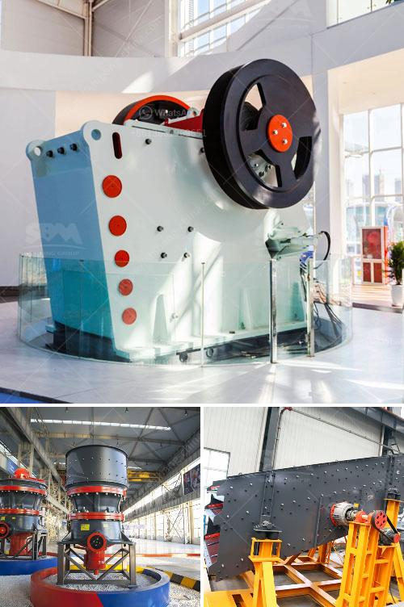

<h3>trapezium grinding mill</h3>
The trapezium grinding mill is a new type of grinding equipment developed by our company's experts in the combination of international advanced grinding technology and experience. It adopts the latest technology and integrates advanced design and shape into one.

The trapezium grinding mill is widely used for grinding non-flammable and non-explosive materials for industries such as mining, metallurgy, chemical engineering, building materials, water conservancy, and smelting. It can be used to grind limestone, calcite, barite, dolomite, potassium feldspar, marble, talcum, gypsum, kaolin, bentonite, medical stone, rock phosphate, manganese ore, iron ore, quartz, active carbon, carbon black, ceramic, coal, etc.

One of the main advantages of the trapezium grinding mill is its stable performance. The main shaft and the grinding roller device are connected by a plum blossom frame, which is equipped with a spring pressurizing device. Compared with traditional Raymond mills, this design greatly increases the pressure on the grinding roller, resulting in improved efficiency and a longer service life of the roller and grinding ring.

The trapezium grinding mill has a unique curved blade design. The blades are continuously curved, which avoids the phenomenon of material stagnation in the grinding chamber and greatly improves the grinding efficiency. Moreover, the blade is made of wear-resistant material, which prolongs its service life.

Another notable feature of the trapezium grinding mill is the classification system. It adopts a high-density impeller classifier, which has a high classification efficiency and accurate fineness control. The fineness of the final product can be adjusted within a range of 80-325 mesh. This feature is particularly important for industries with strict product fineness requirements.

In terms of environmental protection, the trapezium grinding mill has made significant progress. It is equipped with a pulse dust collector, which can effectively collect and process dust generated during the grinding process, reducing environmental pollution and improving the workshop environment.

Moreover, the trapezium grinding mill has a compact structure and covers an area of small size. It can be installed indoors or outdoors, which greatly saves installation space and infrastructure investment.

In conclusion, the trapezium grinding mill is a versatile and efficient grinding equipment suitable for various industries. With its stable performance, unique curved blade design, high classification efficiency, and environmental-friendly features, it has been widely recognized and favored by users. Whether it is used for grinding limestone, calcite, or other non-flammable and non-explosive materials, the trapezium grinding mill will surely bring excellent grinding results and create more value for customers.
<h3>Contact us</h3><ul><li><strong>Whatsapp:&nbsp;<a href="https://wa.me/8613661969651">+8613661969651</a></strong></li><li><a href="https://swt.shibang-china.com/?git&amp;zhl&amp;trapezium grinding mill"><strong>Online Service(chat now)</strong></a></li></ul><h3>Related</h3><ul><li><a href='crushers for sale in.md'>crushers for sale in</a></li><li><a href='cement clinker grinding manufacturer.md'>cement clinker grinding manufacturer</a></li><li><a href='cde sand wash plant for sale.md'>cde sand wash plant for sale</a></li><li><a href='stones grinding plant thailand.md'>stones grinding plant thailand</a></li><li><a href='price and 900 stone crusher.md'>price and 900 stone crusher</a></li></ul>