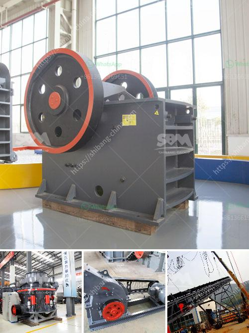

<h3>trapizium mill for purvelising</h3>
In the ever-evolving realm of industrial machinery, the Trapezium Mill stands tall as a crucial tool for pulverizing various materials. From minerals to stones, ores to cement clinkers, this mill has been widely acclaimed for its efficiency and reliability. With its unique design and advanced technology, it has become an indispensable part of many industries.

The Trapezium Mill gets its name from its trapezoidal shape, which reflects the distinctive design of its grinding roller and grinding ring. This mill utilizes multiple grinding rollers and grinding rings to achieve outstanding pulverization efficiency. The design allows for the materials to be fed into the mill through a central inlet, where they are then evenly distributed to the grinding rollers and grinding rings. As the materials are ground, the centrifugal force produced by the rotation of the grinding rollers drives the finely ground particles towards the center of the mill. This unique grinding mechanism ensures uniform and thorough pulverization, making it ideal for a wide range of applications.

One remarkable feature of the Trapezium Mill is its ability to handle both dry and wet materials effectively. Whether it is a dry ore or a wet cement clinker, this mill can process them with equal ease. This versatility makes it highly adaptable to various industry needs, especially in the mineral processing and cement industries. By utilizing this mill, companies can reduce their reliance on multiple machines, thus saving both space and costs.

The Trapezium Mill also boasts an advanced dust removal system, which addresses environmental concerns. The mill is equipped with a bag filter that efficiently cleans the air from fine particles and dust. This not only ensures a clean and healthy working environment but also makes it compliant with environmental regulations. By effectively dealing with dust, this mill contributes to the sustainability efforts of industries worldwide.

Furthermore, the design and construction of this mill prioritize efficiency and durability. The grinding rollers and grinding rings are made of high-quality materials that undergo rigorous testing to ensure their strength and resistance to wear. This construction guarantees a longer lifespan for the mill, reducing maintenance and replacement costs. The overall energy consumption of the Trapezium Mill is also optimized, making it an energy-efficient choice for businesses looking for sustainable solutions.

In addition to its impressive operational features, the Trapezium Mill offers a user-friendly experience. Its simple design and easy-to-use controls allow operators to quickly learn and efficiently operate the mill. The maintenance process is also streamlined, thanks to its modular construction. This enables easy access to the internal components, minimizing downtime during routine inspections or repairs.

In conclusion, the Trapezium Mill has emerged as an essential tool for pulverizing various materials in multiple industries. With its distinctive design, efficiency, and adaptability, it proves to be a significant asset for businesses worldwide. The mill's ability to handle both dry and wet materials, advanced dust removal system, and durability make it a reliable choice for those seeking high-performance industrial machinery. As industries evolve and seek sustainable solutions, the Trapezium Mill continues to play a vital role in driving productivity and efficiency.
<h3>Contact us</h3><ul><li><strong>Whatsapp:&nbsp;<a href="https://wa.me/8613661969651">+8613661969651</a></strong></li><li><a href="https://swt.shibang-china.com/?git&amp;zhl&amp;trapizium mill for purvelising"><strong>Online Service(chat now)</strong></a></li></ul><h3>Related</h3><ul><li><a href='slag crushing machine.md'>slag crushing machine</a></li><li><a href='sewa mesin jaw crusher.md'>sewa mesin jaw crusher</a></li><li><a href='marble crusher cost.md'>marble crusher cost</a></li><li><a href='gravel pebbles mining south africa.md'>gravel pebbles mining south africa</a></li><li><a href='distributors of conveyor belts in mexico.md'>distributors of conveyor belts in mexico</a></li></ul>