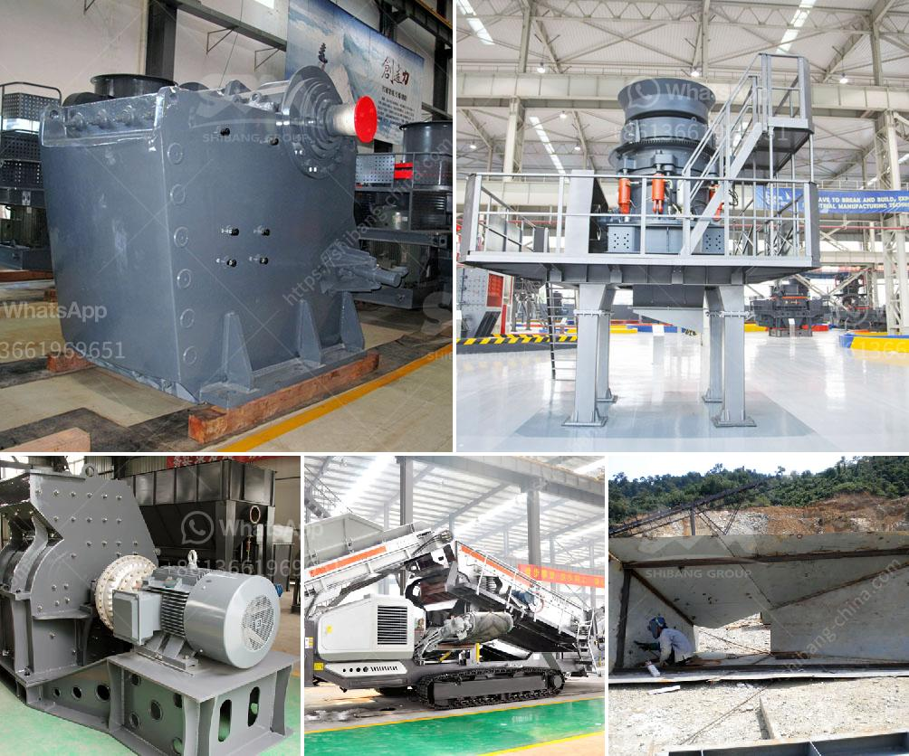

<h3>turkey ball mill company</h3>
Turkey is a vast country with rich natural resources. One of the booming sectors in this country is the mining industry. As a result, there is a growing demand for grinding equipment, including ball mills, sag mills, and rod mills. Turkey Ball Mill Company is one of the leading companies in the sector with an experience spanning over 30 years.

Turkey Ball Mill Company has a strong market presence in Turkey and abroad and operates with a team of approximately 30 employees. These professionals are based in the company's headquarters, located in the industrial zone of Nigde, Turkey. In addition, the company has a well-established network of dealers and distributors across the country, which allows them to efficiently reach their customers.

The company's main focus is to provide innovative and energy-efficient grinding solutions to their clients. The ball mills manufactured by Turkey Ball Mill Company are highly reliable and are designed to operate under the most severe conditions. Our ball mill machines are known for their superior quality and endurance. We take pride in our product range, which is manufactured using premium-grade materials to ensure durability and long-lasting performance.

Turkey Ball Mill Company offers a comprehensive range of services to support their customers throughout the whole process. From the initial consultation and project planning to the installation and maintenance, the company provides personalized solutions tailored to each client's needs. Moreover, Turkey Ball Mill Company constantly invests in research and development to improve their products and stay at the forefront of grinding technology.

In recent years, Turkey Ball Mill Company has expanded its market reach to several countries, including Iraq, Lebanon, Jordan, Bahrain, Qatar, and South Africa. This expansion has allowed the company to gain international recognition for its exceptional products and services.

With a commitment to innovation, customer satisfaction, and continuous improvement, Turkey Ball Mill Company is setting new standards in the grinding industry. Their dedication to excellence has made them a reliable partner for businesses looking for high-quality grinding equipment. As they continue to grow, Turkey Ball Mill Company aims to strengthen its presence in the global market, establishing itself as a trusted name in the industry.
<h3>Contact us</h3><ul><li><strong>Whatsapp:&nbsp;<a href="https://wa.me/8613661969651">+8613661969651</a></strong></li><li><a href="https://swt.shibang-china.com/?git&amp;zhl&amp;turkey ball mill company"><strong>Online Service(chat now)</strong></a></li></ul><h3>Related</h3><ul><li><a href='cost of ball mill in india.md'>cost of ball mill in india</a></li><li><a href='18 36 inch jaw crusher plant in south africa.md'>18 36 inch jaw crusher plant in south africa</a></li><li><a href='stone crusher for gravel.md'>stone crusher for gravel</a></li><li><a href='iron slag crusher india.md'>iron slag crusher india</a></li><li><a href='mobile crushing alocation.md'>mobile crushing alocation</a></li></ul>