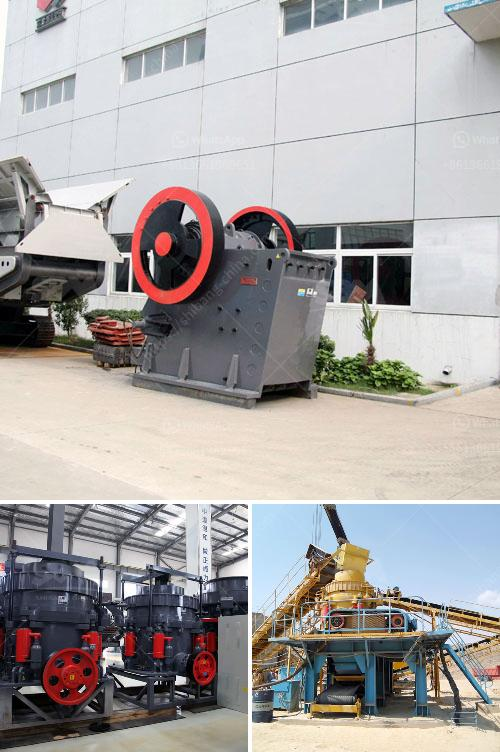

<h3>turkey dolomite crushing plant</h3>
Dolomite is a natural mineral composed of calcium magnesium carbonate. Dolomite mining is extensively undertaken in many parts of the world, including Turkey, where it is predominantly mined for various industrial applications. Turkey is known for its rich dolomite reserves and is globally recognized as one of the key players in the dolomite market.

Turkey boasts numerous dolomite crushing plants, specifically designed for dolomite mining. Many crushing plants are designed to meet the unique requirements of the mining industry, which directly influences the specific designs and capacities of these plants. The crushing plants in Turkey are typically located near the dolomite deposits to minimize transportation costs due to the heavy weight of dolomite materials.

One of the leading crushing plant manufacturers in Turkey, HAWK PLANT, has been serving Turkish mining industry for over 20 years. Every aspect of the crushing plant itself has been designed with the utmost attention to detail and the highest quality standards. The crushing plant is equipped with the latest and advanced crushing technology, enabling it to fully operate in a dust-free environment and maximize its overall efficiency.

One of the primary benefits of the Turkey dolomite crushing plant is its high capacity and excellent crushing ratio. With its advanced technology and large capacity machinery, the plant can handle a variety of raw materials, including dolomite, limestone, and gypsum, among others. The plant can obtain high-quality aggregates, which are essential for many construction projects.

Moreover, the crushing plant undergoes rigorous testing and maintenance to ensure that it can withstand the demanding conditions of the mining industry. The plant's strong and durable structure is designed to serve Turkey's mining sector for many years. Additionally, the plant is equipped with heavy-duty machinery that can process large quantities of dolomite quickly and efficiently.

The Turkey dolomite crushing plant is designed in a way that significantly reduces operational costs and significantly improves production efficiency. This is primarily due to its unique design that enables easy maintenance and troubleshooting. Potential issues can be detected early on, ensuring minimal downtime and maximum productivity.

Furthermore, Turkey Dolomite Crushing Plant is also equipped with an innovative system for dust suppression, which significantly reduces dust emissions. This is crucial not only for the protection of the environment but also for the health and safety of the workers. The dust suppression system ensures that all dust particles are efficiently contained within the facility, preventing their dispersion into the atmosphere.

Overall, the Turkey Dolomite Crushing Plant has proven to be a highly efficient, reliable, and environmentally friendly solution for dolomite mining. The plant vastly enhances the efficiency and productivity of dolomite crushing operations, minimizing production downtime and meeting the highest quality standards. With its advanced technology and robust design, the plant is poised to contribute significantly to Turkey's booming mining industry.
<h3>Contact us</h3><ul><li><strong>Whatsapp:&nbsp;<a href="https://wa.me/8613661969651">+8613661969651</a></strong></li><li><a href="https://swt.shibang-china.com/?git&amp;zhl&amp;turkey dolomite crushing plant"><strong>Online Service(chat now)</strong></a></li></ul><h3>Related</h3><ul><li><a href='komatsu mobile impact crusher.md'>komatsu mobile impact crusher</a></li><li><a href='grinding ball mill machine manufacturer europe.md'>grinding ball mill machine manufacturer europe</a></li><li><a href='ball mills for grinding lime.md'>ball mills for grinding lime</a></li><li><a href='china clay washing process.md'>china clay washing process</a></li><li><a href='small scale mining rock crushers for sale.md'>small scale mining rock crushers for sale</a></li></ul>