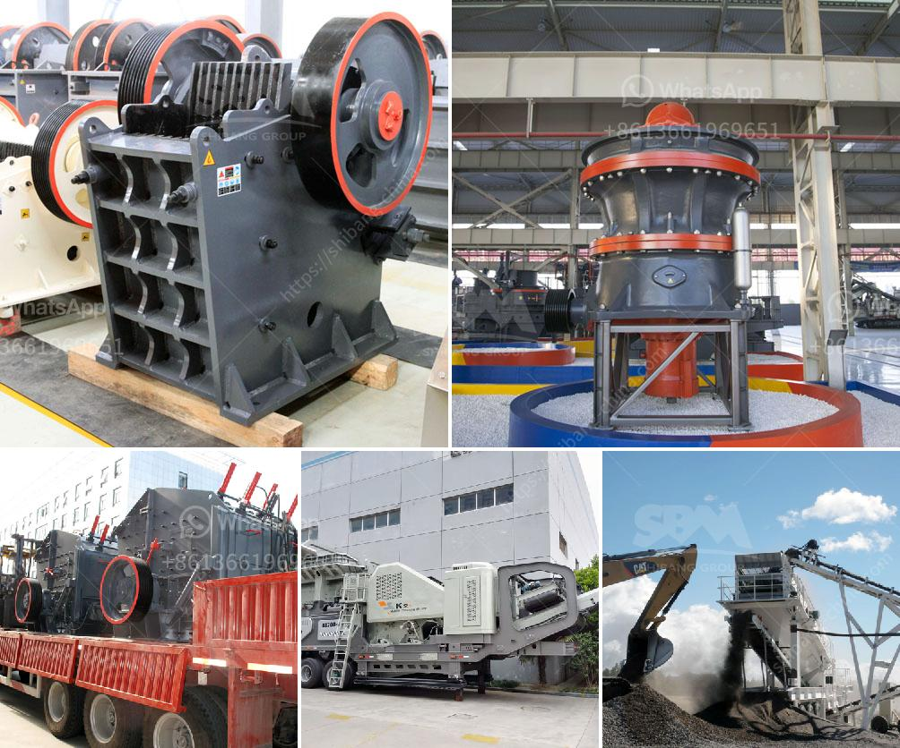

<h3>turkey plant production line of gypsum powder</h3>
Turkey is one of the leading countries in the world when it comes to gypsum production. With its rich reserves and state-of-the-art production facilities, Turkey has become a major supplier of gypsum powder. A key component of the construction industry, gypsum powder is widely used in the production of wallboards, plaster, and other building materials.

One of the main production lines in Turkey dedicated to gypsum powder is the Turkey plant. This plant employs cutting-edge technology and advanced machinery to ensure the high-quality production of gypsum powder.

The process of gypsum powder production starts with the extraction of gypsum ore from the quarry. The ore is then crushed and processed into a fine powder through a series of crushers, mills, and classifiers. This ensures that the gypsum powder has a consistent particle size and purity.

Once the gypsum powder is obtained, it goes through a series of additional processes to enhance its quality. The powder is dried in a rotary dryer, which removes any excess moisture and ensures that the final product is free-flowing and easy to handle. This is followed by a process called calcination, where the powder is heated at high temperatures to remove any impurities and further enhance its purity.

Next, the gypsum powder is packaged and stored in a controlled environment to maintain its quality. The packaging process is crucial to ensure that the powder remains free from contaminants and maintains its properties over time. High-quality packaging materials and strict quality control measures are employed to guarantee the integrity of the final product.

In addition to the advanced technology used in the production line, the Turkey plant also prioritizes sustainability and environmental responsibility. The plant has implemented various measures to minimize its environmental impact, including efficient energy usage, waste management systems, and the use of environmentally friendly packaging materials. This commitment to sustainability not only benefits the environment but also contributes to the plant's reputation as a responsible and ethical producer.

The gypsum powder produced at the Turkey plant is highly sought after in both domestic and international markets. Its high purity, consistent particle size, and superior quality set it apart from competitors. This has led to a significant increase in demand for Turkish gypsum powder, with many construction companies and contractors choosing it as their preferred choice for various applications.

With its state-of-the-art production line and commitment to quality and sustainability, the Turkey plant is a leading player in the global gypsum powder industry. Through continuous investment in technology and research, the plant aims to maintain its position as a trusted supplier of high-quality gypsum powder for years to come.
<h3>Contact us</h3><ul><li><strong>Whatsapp:&nbsp;<a href="https://wa.me/8613661969651">+8613661969651</a></strong></li><li><a href="https://swt.shibang-china.com/?git&amp;zhl&amp;turkey plant production line of gypsum powder"><strong>Online Service(chat now)</strong></a></li></ul><h3>Related</h3><ul><li><a href='stone crusher dealers.md'>stone crusher dealers</a></li><li><a href='stone crusher company in dubai.md'>stone crusher company in dubai</a></li><li><a href='prices of sand making machine.md'>prices of sand making machine</a></li><li><a href='jaw crusher engine and complete set.md'>jaw crusher engine and complete set</a></li><li><a href='pebble crusher manufacturer.md'>pebble crusher manufacturer</a></li></ul>