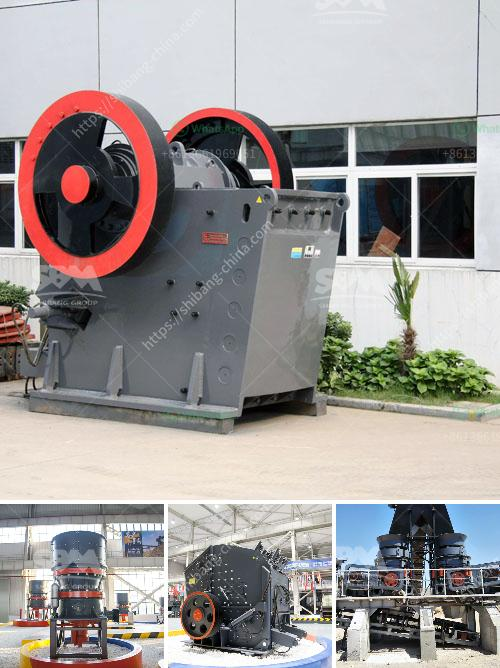

<h3>two roller mill</h3>
In the milling industry, where consistency and uniformity are key, the two roller mill has emerged as a vital piece of equipment for achieving these goals. This machine is widely used in various sectors, from agriculture to food processing and everything in between. With its ability to crush and grind materials into fine powders, the two roller mill has become an essential tool for many businesses.

A two roller mill consists of two horizontal rollers placed parallel to each other. These rollers rotate at different speeds, crushing and grinding the materials that pass through them. The gap between the rollers can be adjusted, allowing for different levels of fineness depending on the desired end product. This versatility makes the two roller mill a valuable asset in industries where particle size distribution is critical.

One of the primary applications of the two roller mill is in the agricultural sector. Farmers use this machine to process various grains and oilseeds into livestock feed. By crushing and grinding these ingredients, the nutritional value is enhanced, ensuring healthier and more productive animals. The adjustable gap between the rollers allows farmers to control the particle size, optimizing the feed for different animals and their specific dietary needs.

Another significant application of the two roller mill is in the brewing industry. Malted grains, such as barley, are processed through this machine to extract fermentable sugars. The crushed grains, known as grist, are then mixed with hot water in a process called mashing. This step transforms the starches in the grains into fermentable sugars, which are essential for yeast to produce alcohol during fermentation. The two roller mill plays a vital role in this process, ensuring the grains are ground to the optimal particle size to maximize sugar extraction.

Food processing industries also rely on the two roller mill for various applications. Ingredients like sugar, spices, and herbs can be processed through this machine to obtain fine powders. This allows for better dispersion and uniform distribution when adding these ingredients to food products. Additionally, by grinding ingredients into fine powders, their flavors and aromas are released, enhancing the overall taste experience.

In addition to its applications in agriculture and food processing, the two roller mill is also utilized in industries such as pharmaceuticals, chemicals, and cosmetic manufacturing. In these sectors, the machine is used to pulverize raw materials, enabling precise and consistent formulation of products. By controlling the particle size, manufacturers can ensure the desired attributes and functionalities of their end products.

In conclusion, the two roller mill is a versatile and efficient tool widely used in the milling industry. Its ability to crush and grind materials to various particle sizes makes it indispensable in agriculture, brewing, food processing, pharmaceuticals, and other sectors. With its adjustable gap and precise control over particle size, this machine offers businesses the flexibility they need to achieve uniformity and consistency in their processes. As technology continues to advance, we can expect the two roller mill to evolve and contribute even more to the efficiency and productivity of various industries.
<h3>Contact us</h3><ul><li><strong>Whatsapp:&nbsp;<a href="https://wa.me/8613661969651">+8613661969651</a></strong></li><li><a href="https://swt.shibang-china.com/?git&amp;zhl&amp;two roller mill"><strong>Online Service(chat now)</strong></a></li></ul><h3>Related</h3><ul><li><a href='kenya quartz crushing.md'>kenya quartz crushing</a></li><li><a href='cebu rock crusher.md'>cebu rock crusher</a></li><li><a href='feasibility study on barite milling plants.md'>feasibility study on barite milling plants</a></li><li><a href='feldspar production plant.md'>feldspar production plant</a></li><li><a href='200 tph crusher plant.md'>200 tph crusher plant</a></li></ul>