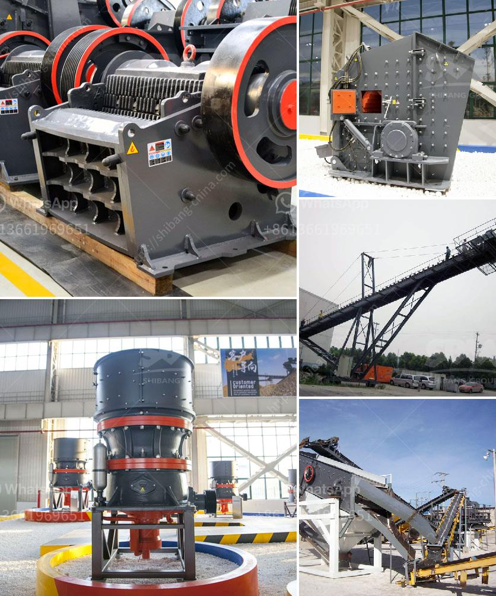

<h3>ultra white silica processing</h3>
Silica, a naturally occurring mineral abundant in the earth's crust, is widely used across various industries due to its unique properties. While regular silica in its natural form has a white appearance, its color can be enhanced through a specific processing technique, leading to the production of ultra white silica. This ultra white variant finds numerous applications, particularly in industries where color purity and brightness are of utmost importance, such as the cosmetics, ceramics, and electronics industries.

The processing of ultra white silica involves several key steps, each crucial for achieving the desired end product. Let's take a closer look at these steps:

1. Silica purification: The first step in the processing involves purifying the raw silica to remove impurities. This typically includes magnetic separation, froth flotation, and chemical treatment to eliminate iron, aluminum, and other impurities.

2. Particle size reduction: Next, the silica is subjected to grinding and milling processes to achieve a smaller particle size. This enhances the dispersion ability of the silica, enabling it to mix more evenly with other materials during future applications.

3. Acid treatment: Acid treatment is a common technique used to modify the surface properties of silica and improve its dispersibility. Through acid treatment, the surface of silica particles becomes more reactive, allowing for better integration with various matrices in different applications.

4. Calcination: Calcination is a thermal treatment process that involves heating the silica at high temperatures. This step eliminates residual organic compounds and volatile impurities, resulting in improved purity and increased whiteness of the final product.

5. Surface coating: Depending on the intended application, surface coating may be applied to further improve the properties of ultra white silica. Coating materials such as polymers or metal oxides can be used to enhance dispersibility, provide better adhesion, or impart specific functionalities.

The production of ultra white silica finds applications across various industries. In the cosmetics industry, it is a key ingredient in skin care products, providing desirable opacity, light diffusion, and oil absorption properties. In ceramics, ultra white silica is used to achieve bright white glazes, improving the aesthetic appeal of ceramic products like tiles and tableware.

The electronics industry also benefits from ultra white silica, particularly in the production of optical components. Its exceptional whiteness and clarity make it ideal for optical fibers, lenses, and other light-transmitting devices. Furthermore, ultra white silica is utilized in the manufacturing of high-precision electronic components, where its exceptional purity ensures minimal interference and better performance.

In conclusion, the processing of ultra white silica involves several essential steps, including purification, particle size reduction, acid treatment, calcination, and surface coating. These steps work in tandem to enhance the whiteness, purity, and dispersibility of silica particles, making them suitable for a wide range of applications. From cosmetics to ceramics and electronics, the unique properties of ultra white silica contribute to the development of high-quality, visually appealing, and high-performing products across diverse industries.
<h3>Contact us</h3><ul><li><strong>Whatsapp:&nbsp;<a href="https://wa.me/8613661969651">+8613661969651</a></strong></li><li><a href="https://swt.shibang-china.com/?git&amp;zhl&amp;ultra white silica processing"><strong>Online Service(chat now)</strong></a></li></ul><h3>Related</h3><ul><li><a href='cost of grinder machine mining crusher.md'>cost of grinder machine mining crusher</a></li><li><a href='cement plant price in pakistan.md'>cement plant price in pakistan</a></li><li><a href='to do with the stone crusher.md'>to do with the stone crusher</a></li><li><a href='gypsum board making machine price in pakistan.md'>gypsum board making machine price in pakistan</a></li><li><a href='pilot scale ball mills.md'>pilot scale ball mills</a></li></ul>