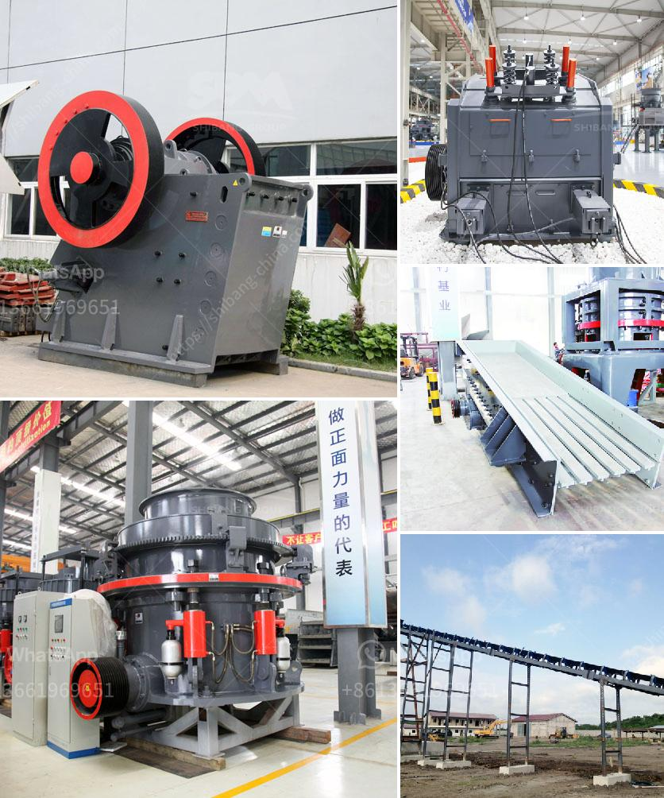

<h3>used ball mills philippines</h3>
Ball mills are widely used in the production of cement, silicate products, new building materials, refractory materials, fertilizers, black and non-ferrous metal dressings, and glass ceramics, among others. They are essential equipment for grinding various ores and other materials. Ball mills have unique advantages in ore grinding compared to other types of grinding mills. They are cost-effective, efficient, and offer reliable performance. In the Philippines, where mining is a crucial source of income, keeping the ball mills operational is vital for miners.

Ball mills are relatively simple machines with basic principles that are easy to understand. They consist of a rotating cylinder that contains grinding media – metallic or ceramic balls – and material to be ground. The cylinder is filled with the grinding media, and the rotating motion causes the material to be ground.

Used ball mills, often called second-hand or refurbished mills, can offer significant savings over a brand-new ball mill. Purchasing a used ball mill also offers multiple benefits, including a faster setup time, lower startup costs, and more efficient milling performance.

One of the significant advantages of used ball mills is lower startup costs. New ball mills can be expensive, making it difficult for small-scale miners and new entrants to afford them. However, used ball mills are often available at a fraction of the cost of new mills, making them a more accessible option for miners.

Another benefit of used ball mills is the shorter setup time. Used ball mills are already assembled and ready for use. This eliminates the need for assembly or installation, saving valuable time and money. The mills can be put to work immediately, reducing downtime and increasing productivity.

Used ball mills can also offer higher milling efficiency compared to new mills. As ball mills are used over time, the grinding media inside them gets worn and becomes small in size. This smaller media enables more grinding contact between the balls and the material being ground, resulting in improved milling efficiency. In contrast, new ball mills require the grinding media to wear down to an optimum size for efficient grinding, which takes time.

The Philippines is rich in mineral resources, and mining plays a significant role in the country's economy. Used ball mills present an affordable and practical solution for miners to continuously extract minerals and yield high-quality ore. By purchasing used equipment, miners can extend the lifespan of the mills, optimize their ore grinding operations, and reduce costs.

While used ball mills have their advantages, buyers should exercise caution when purchasing second-hand equipment. Conducting thorough inspections, checking for wear and tear, and ensuring the internal components are in good condition are crucial steps in the used equipment buying process.

In conclusion, used ball mills offer a cost-effective, efficient, and reliable solution for ore grinding operations in the Philippines. Their affordability, shorter setup time, and improved milling efficiency make them an ideal choice for small-scale miners or those considering expanding their mining operations. However, potential buyers should always perform proper due diligence to ensure the quality and condition of the used ball mills they are considering.
<h3>Contact us</h3><ul><li><strong>Whatsapp:&nbsp;<a href="https://wa.me/8613661969651">+8613661969651</a></strong></li><li><a href="https://swt.shibang-china.com/?git&amp;zhl&amp;used ball mills philippines"><strong>Online Service(chat now)</strong></a></li></ul><h3>Related</h3><ul><li><a href='hammer mill size reduction.md'>hammer mill size reduction</a></li><li><a href='industrial roller mill.md'>industrial roller mill</a></li><li><a href='clay grinding mill.md'>clay grinding mill</a></li><li><a href='tph rock crusher.md'>tph rock crusher</a></li><li><a href='list of cement plants in nalgonda district.md'>list of cement plants in nalgonda district</a></li></ul>