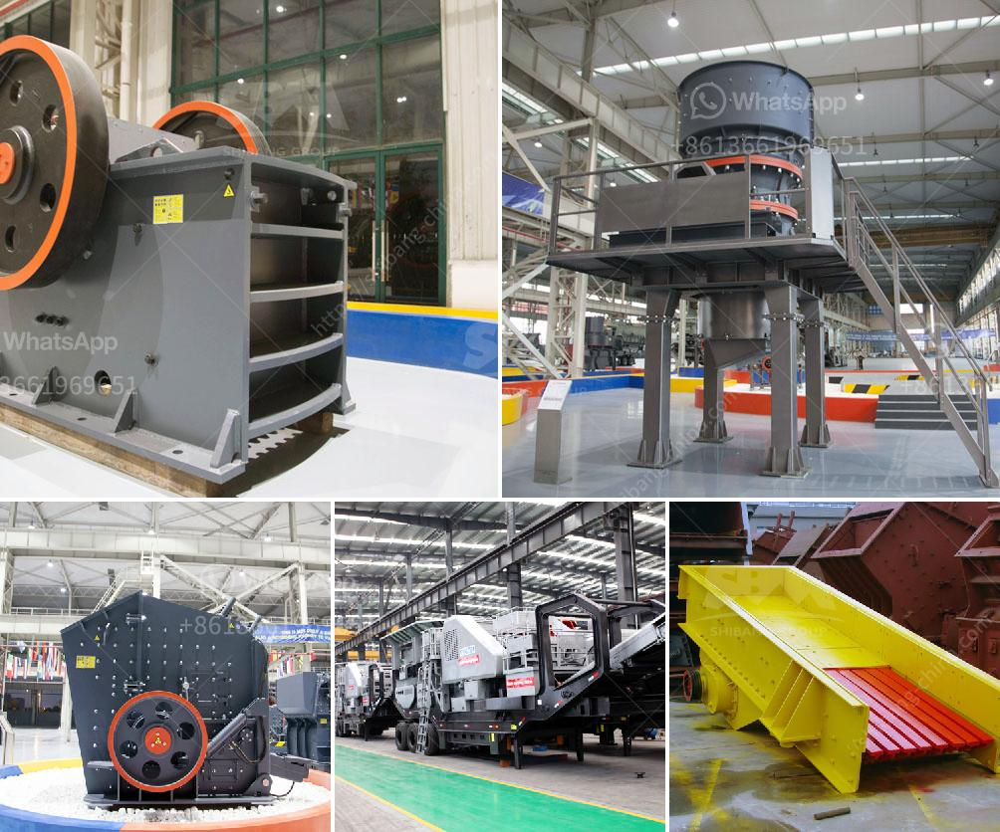

<h3>used barite crusher price</h3>
Barite, also known as barytes, is the mineral form of barium sulfate. It is commonly used as a weighting agent for drilling fluids in oil and gas exploration. Due to its high density and low solubility, barite is an essential component in the drilling process, providing stability and preventing blowouts.

As the demand for oil and gas continues to rise, so does the need for barite. This has led to an increase in the demand for barite crushers, machines specifically designed to crush and grind barite into smaller particles. However, buying a brand new crusher can be a costly endeavor, especially for small-scale operations or individuals on a budget. That's where used barite crushers come in.

Used barite crushers offer an affordable alternative to purchasing a brand new crusher. Often, these crushers are still in great condition and can provide many more years of reliable service. They are a cost-effective way to get the job done and meet the demands of the drilling industry.

The price of used barite crushers can vary depending on factors such as the age and condition of the machine, the size of the feed material, and the desired product size. However, in general, used crushers are significantly cheaper than their brand new counterparts. This makes them an attractive option for businesses and individuals looking to cut costs without compromising on quality.

There are various sources where used barite crushers can be found. Online marketplaces and auctions are popular platforms to find both new and used machinery, including crushers. Additionally, specialized dealers and brokers may have a selection of used crushers available for purchase. However, it is important to thoroughly inspect any used equipment before making a purchase to ensure it is in good working condition.

In conclusion, used barite crushers offer an affordable solution for those in need of crushing equipment for barite processing. With their lower price point, they are an attractive option for businesses and individuals looking to save money while still meeting the demands of the drilling industry. As always, it is important to thoroughly inspect any used equipment before purchasing to ensure it is in good condition and will meet your specific needs.
<h3>Contact us</h3><ul><li><strong>Whatsapp:&nbsp;<a href="https://wa.me/8613661969651">+8613661969651</a></strong></li><li><a href="https://swt.shibang-china.com/?git&amp;zhl&amp;used barite crusher price"><strong>Online Service(chat now)</strong></a></li></ul><h3>Related</h3><ul><li><a href='price of grinder machine in malaysia.md'>price of grinder machine in malaysia</a></li><li><a href='stone cracker machines.md'>stone cracker machines</a></li><li><a href='stone crusher price in australia.md'>stone crusher price in australia</a></li><li><a href='quarry machines repairing centre in chennai.md'>quarry machines repairing centre in chennai</a></li><li><a href='trapezium grinding mill.md'>trapezium grinding mill</a></li></ul>