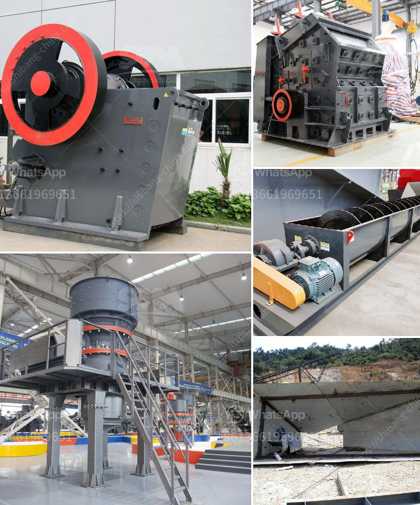

<h3>used concrete ready mix plant price</h3>
When it comes to constructing buildings and infrastructure, one of the most essential materials is concrete. To ensure a steady supply of high-quality concrete, many construction companies invest in a concrete ready mix plant. However, for those on a tight budget, purchasing a brand-new plant may not be financially viable. Luckily, there is a cost-effective alternative – used concrete ready mix plants.

Used concrete ready mix plants come with several advantages, starting with their significantly lower price point compared to new plants. This cost savings allows construction companies to allocate their budget more efficiently and invest in other areas of their projects.

Another benefit of purchasing a used concrete ready mix plant is the opportunity to acquire a well-maintained, high-performing plant that still has many years of service life left. Many plant owners regularly service and maintain their equipment, ensuring its optimal working condition. By purchasing a used plant from a trusted source, construction companies can expect reliable performance without compromising on quality.

One may wonder how to determine the price of a used concrete ready mix plant. The price varies based on several factors, including the brand, model, production capacity, condition, and age of the plant. Manufacturers of used concrete ready mix plants usually offer competitive pricing, taking into account these factors and the overall market demand.

A used concrete ready mix plant typically falls within the price range of several thousand to a few hundred thousand dollars, depending on the aforementioned factors. For smaller construction projects or businesses operating on a smaller scale, a low-capacity, more affordable plant may be suitable. On the other hand, larger-scale projects may require higher-capacity plants, which may come at a higher cost.

In conclusion, purchasing a used concrete ready mix plant is an excellent option for construction companies looking to save money without compromising on quality. With the opportunity to acquire a well-maintained plant at a fraction of the cost of a new one, businesses can efficiently allocate their budget and secure a reliable and high-performing concrete production facility. Whether a company is embarking on a small or large-scale project, exploring the market for used concrete ready mix plants can be a wise investment decision.
<h3>Contact us</h3><ul><li><strong>Whatsapp:&nbsp;<a href="https://wa.me/8613661969651">+8613661969651</a></strong></li><li><a href="https://swt.shibang-china.com/?git&amp;zhl&amp;used concrete ready mix plant price"><strong>Online Service(chat now)</strong></a></li></ul><h3>Related</h3><ul><li><a href='german crusher manufacturers.md'>german crusher manufacturers</a></li><li><a href='mobile vibrating screen for iron.md'>mobile vibrating screen for iron</a></li><li><a href='feasibility study for stone crusher plants.md'>feasibility study for stone crusher plants</a></li><li><a href='jual jaw crusher bekas surabaya.md'>jual jaw crusher bekas surabaya</a></li><li><a href='coal vibration equipment size.md'>coal vibration equipment size</a></li></ul>