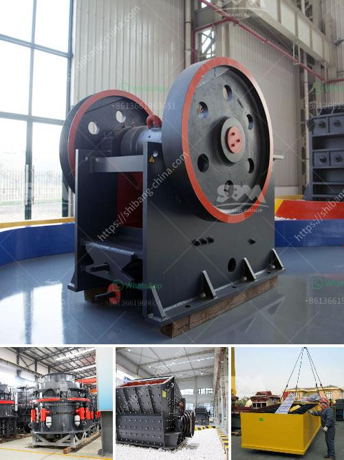

<h3>used cone crusher for sale ton per hour</h3>
For many businesses, purchasing the equipment they need is always the best option. However, when equipment is just too expensive for your budget, it's time to start considering other options. One such option is the purchase of a used cone crusher for sale. These machines can be quite expensive, especially when you're purchasing them new, but with a little patience and effort, you can find a reliable used cone crusher for a fraction of the cost.

Used cone crushers offer several advantages over new ones. First of all, they are often more affordable. Secondly, they require far less maintenance than new equipment. When you purchase a used cone crusher, you can expect to pay significantly less than you would for a new machine. The cost of ownership is also significantly lower because used machines typically have lower maintenance and repair costs.

Another advantage of purchasing a used cone crusher is the opportunity to inspect the machine thoroughly before making a decision. As with any investment, you should never rush into a purchase without carefully examining the equipment. When purchasing a used cone crusher, you have the chance to see it in person, test it, and even bring a knowledgeable technician to inspect the machine for potential issues. This level of inspection is rarely possible with new equipment, as it is typically sealed in a crate and shipped directly to the customer.

While purchasing a used cone crusher is undoubtedly a cost-effective option, there are a few factors to consider to ensure you make the right choice. First and foremost, you should determine the capacity and size of the cone crusher you need. Each crusher has a specific capacity, and finding the one that matches your needs is crucial.

It's also important to consider the condition of the machine. Even though it's used, you don't want to purchase a cone crusher that is on its last legs. Ensure that the machine has been well-maintained and is in good working condition. If possible, ask for maintenance records or contact the previous owner to get an idea of how the machine has been used and maintained.

When searching for a used cone crusher for sale, it's essential to find a reputable supplier. Many suppliers specialize in used equipment and have a wide selection of cone crushers available. Before making a purchase, research the supplier's reputation, read customer reviews, and make sure they offer proper after-sales support.

Investing in a used cone crusher for sale is a cost-effective option to consider. Cone crushers are designed to crush hard and abrasive materials, making them ideal for secondary and tertiary applications. However, the initial investment can be quite high. Therefore, purchasing a used cone crusher allows businesses to save money while still acquiring a reliable piece of equipment. Remember to thoroughly inspect the machine and choose a trustworthy supplier to ensure a successful purchase.
<h3>Contact us</h3><ul><li><strong>Whatsapp:&nbsp;<a href="https://wa.me/8613661969651">+8613661969651</a></strong></li><li><a href="https://swt.shibang-china.com/?git&amp;zhl&amp;used cone crusher for sale ton per hour"><strong>Online Service(chat now)</strong></a></li></ul><h3>Related</h3><ul><li><a href='crawler type mobile crusher.md'>crawler type mobile crusher</a></li><li><a href='silica sand washing machine.md'>silica sand washing machine</a></li><li><a href='size pe 600x900 jaw crusher.md'>size pe 600x900 jaw crusher</a></li><li><a href='aggregate stone crusher price south africa.md'>aggregate stone crusher price south africa</a></li><li><a href='grinding ball mill machine manufacturer europe.md'>grinding ball mill machine manufacturer europe</a></li></ul>