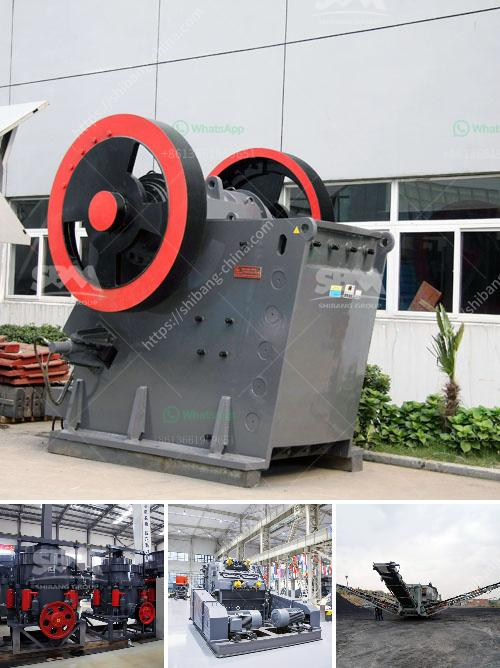

<h3>used copper process plants for sale</h3>
Used copper process plants for sale offer a cost-effective solution for companies looking to expand their copper production capacity or replace old equipment. Copper is one of the most widely used metals globally, essential in various industries such as construction, electronics, and telecommunications. As demand for copper continues to rise, so does the need to find efficient ways of extracting, refining, and processing this valuable resource. 

Buying a used copper process plant provides several advantages. Firstly, it significantly reduces the upfront capital investment required compared to purchasing new equipment. Used process plants are often available at a fraction of the cost of new ones, making it a more accessible option for businesses with budget constraints or those trying to minimize their expenses.

Secondly, used process plants for sale are usually readily available, allowing companies to quickly integrate the new equipment into their existing operations. This ensures minimal downtime and a rapid increase in production capacity, enabling businesses to meet growing demand without delay.

Thirdly, purchasing used copper process plants from a reliable supplier guarantees that the equipment is in good working condition. Reputable sellers thoroughly inspect and refurbish the plants, replacing any worn-out parts and ensuring that they meet all industry standards. This provides buyers with peace of mind, knowing that they are acquiring a quality product that will enhance their production capabilities.

Another advantage is the flexibility that comes with buying used copper process plants. Companies have the freedom to choose from a range of options that best suit their specific requirements. Whether it's a small-scale plant to meet current demand or a larger one to accommodate future growth, the market has a variety of used process plants available, allowing buyers to find the perfect fit for their operations.

In conclusion, investing in used copper process plants for sale is an economical and efficient approach for companies seeking to expand their copper production capabilities. With lower upfront costs, readily available equipment, and dependable suppliers, businesses can quickly enhance their operations and meet growing demand successfully. Furthermore, the flexibility of options ensures that companies can find the right equipment size and capacity to suit their specific needs.
<h3>Contact us</h3><ul><li><strong>Whatsapp:&nbsp;<a href="https://wa.me/8613661969651">+8613661969651</a></strong></li><li><a href="https://swt.shibang-china.com/?git&amp;zhl&amp;used copper process plants for sale"><strong>Online Service(chat now)</strong></a></li></ul><h3>Related</h3><ul><li><a href='stone medina stone mobile crusher.md'>stone medina stone mobile crusher</a></li><li><a href='list of cement plants and their capacities.md'>list of cement plants and their capacities</a></li><li><a href='stone crusher small for quarry project.md'>stone crusher small for quarry project</a></li><li><a href='small size gold mining business plan.md'>small size gold mining business plan</a></li><li><a href='feldspar crusher equipment.md'>feldspar crusher equipment</a></li></ul>