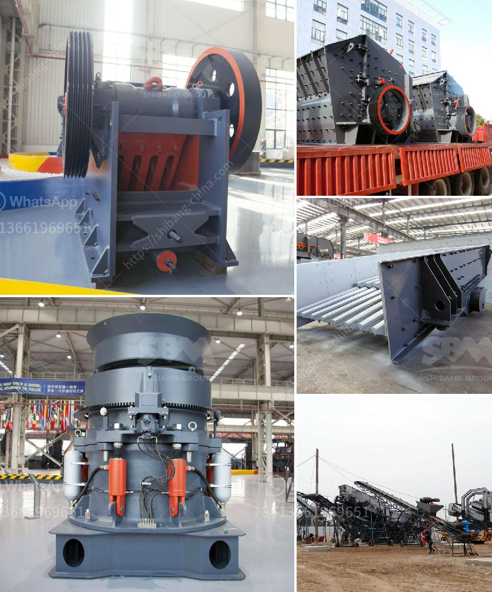

<h3>used crushers prices in nigeria</h3>
Crushers are essential pieces of machinery for mining and mineral processing operations, as they reduce the size of large rocks and stones to smaller ones, gravel, or powder. Used crushers are cost-effective options for many small and medium-sized enterprises (SMEs) in Nigeria. Prices of used crushers in Nigeria vary depending on brand, size, capacity, production, and condition of the equipment. In this article, we'll explore the different factors that determine the prices of used crushers in Nigeria.

The brand and model of a crusher play a significant role in determining its price in Nigeria. Different manufacturers produce crushers of varying quality and performance, resulting in different price ranges. Renowned international brands command higher prices due to their established reputation for durability and efficiency. Additionally, certain crusher models may be more in demand, leading to higher prices in the market.

The size and capacity of a crusher determine its price. Crushers come in various sizes, ranging from small portable crushers to large stationary ones. Larger crushers with higher capacity to crush more significant volumes of material are generally more expensive due to the additional materials and engineering required. Depending on the intended use, SMEs must carefully consider the optimal size and capacity of the crusher to meet their production demands without overpaying for unnecessary features.

The production efficiency of a crusher is often correlated with its price. A more efficient crusher can process more material with less energy consumption, resulting in reduced operating costs. Therefore, crushers with higher production efficiency often come with higher price tags. However, higher-priced crushers may prove to be a worthwhile investment for SMEs, as they can help increase productivity and profitability in the long run.

The condition of used crushers is a significant factor in determining their price. Well-maintained crushers in excellent condition may still fetch higher prices compared to those in poor condition. Before purchasing a used crusher, SMEs should thoroughly inspect the equipment for any signs of wear and tear, damages, or mechanical issues. Investing in a well-maintained crusher may require a higher upfront cost but can save on maintenance and replacement expenses in the future.

Market demand and supply dynamics also influence the prices of used crushers in Nigeria. If there is a high demand for crushers and suitable options are limited, prices may increase. However, when there is ample supply and limited demand, prices tend to decrease. SMEs must carefully monitor the market and keep an eye on the availability and prices of used crushers to make informed purchasing decisions.

In conclusion, the prices of used crushers in Nigeria are determined by various factors, including brand, model, size, capacity, production efficiency, condition of the equipment, and market demand and supply dynamics. To find the best value, SMEs should conduct thorough research, compare prices from different sellers, and consider both the short-term and long-term implications of their purchase. By making the right choice, SMEs can enhance their productivity and profitability while optimizing their budget.
<h3>Contact us</h3><ul><li><strong>Whatsapp:&nbsp;<a href="https://wa.me/8613661969651">+8613661969651</a></strong></li><li><a href="https://swt.shibang-china.com/?git&amp;zhl&amp;used crushers prices in nigeria"><strong>Online Service(chat now)</strong></a></li></ul><h3>Related</h3><ul><li><a href='sell artificial sand mill.md'>sell artificial sand mill</a></li><li><a href='usina de minerio de ferro para venda no mexico.md'>usina de minerio de ferro para venda no mexico</a></li><li><a href='process of coal crushing plant.md'>process of coal crushing plant</a></li><li><a href='small scale quarry mining equipment.md'>small scale quarry mining equipment</a></li><li><a href='limestone field crushing plant.md'>limestone field crushing plant</a></li></ul>