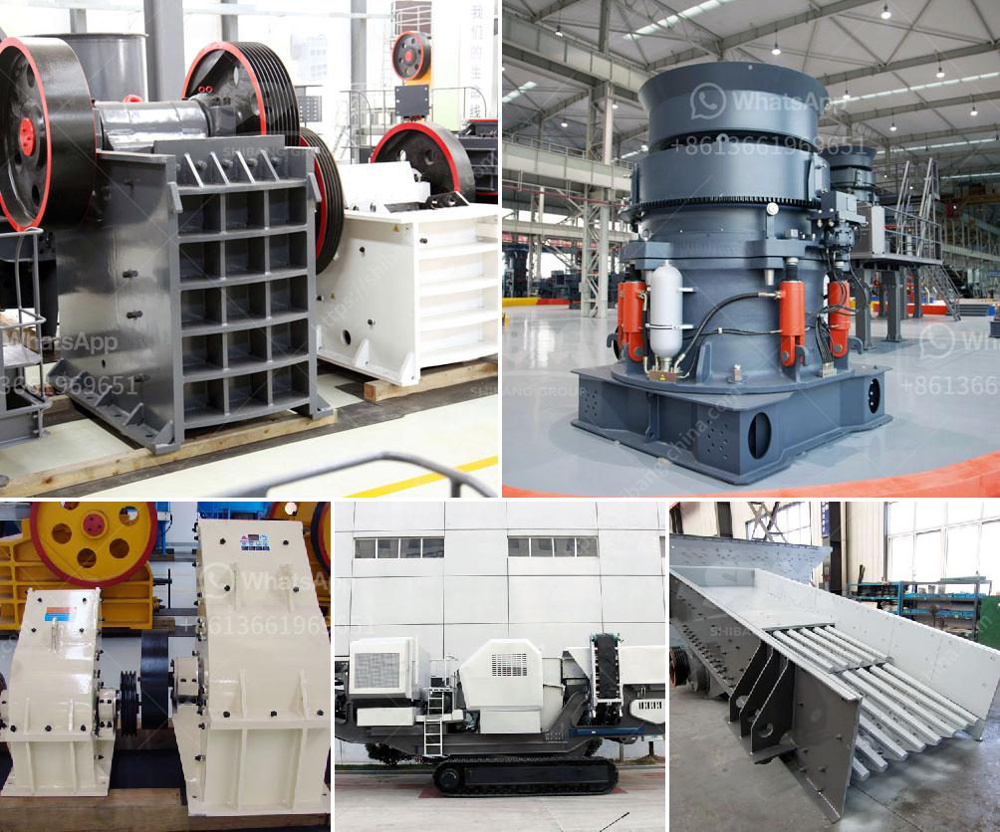

<h3>used gold washer machine plant</h3>
Gold mining is a popular and lucrative venture that has attracted people from all walks of life for centuries. While the methods of mining and extraction have evolved over time, one thing remains constant – the need for efficient equipment. A gold washer machine plant is an essential component of any successful mining operation, ensuring the proper separation and recovery of gold from the ore.

A gold washer machine plant, also known as a gold processing plant, is designed to remove the impurities and extract the gold from the ore. These plants are used to analyze the size distribution of the particles in the ore to optimize the recovery process. The gold washer machine plant consists of several components, including a feeder, scrubber, screen, and concentrator.

The feeder is responsible for ensuring a constant and controlled flow of raw material into the plant. It helps regulate the feed rate and prevent the plant from becoming overloaded. The scrubber is an essential part of the plant as it removes impurities and breaks down clay and ore particles to facilitate easier separation. It is equipped with rotating paddles that vigorously agitate the material, allowing for optimal cleaning.

After the material has passed through the scrubber, it moves onto the screen. The screen is responsible for separating the material based on size. The use of screens with different sized openings allows for the classification of particles and ensures that only the appropriate size material moves forward in the process.

Once the material has been classified, it moves onto the concentrator. The concentrator uses a combination of gravity, centrifugal force, and water flow to separate the gold from the waste material. The gold, being heavier, settles or is captured in a series of specialized riffles or mats, while the waste material is washed away. This process is repeated until the desired level of concentration is achieved.

A used gold washer machine plant offers numerous advantages for mining operations. Firstly, it can significantly reduce the upfront costs associated with purchasing new equipment. While new plants can be expensive, a used plant can offer substantial savings without compromising on quality or efficiency.

Secondly, a used gold washer machine plant allows for a faster setup time. Since the equipment is already assembled, there is no need for time-consuming manufacturing or shipping delays. This allows mining operations to quickly start processing ore and generating revenue.

Lastly, a used gold washer machine plant provides a sustainable and environmentally responsible solution. By opting for a used plant, mining companies reduce the demand for new equipment production, thereby minimizing their carbon footprint. Additionally, reusing equipment helps to mitigate the negative impact of mining on natural resources.

In conclusion, a gold washer machine plant plays a vital role in any gold mining operation. It ensures the optimal separation and recovery of gold from the ore, leading to increased productivity and profitability. Choosing a used plant offers numerous advantages, including cost savings, faster setup time, and a sustainable approach to mining. With the right gold washer machine plant, mining operations can maximize their potential and achieve success in the gold industry.
<h3>Contact us</h3><ul><li><strong>Whatsapp:&nbsp;<a href="https://wa.me/8613661969651">+8613661969651</a></strong></li><li><a href="https://swt.shibang-china.com/?git&amp;zhl&amp;used gold washer machine plant"><strong>Online Service(chat now)</strong></a></li></ul><h3>Related</h3><ul><li><a href='old used farm hammer mills.md'>old used farm hammer mills</a></li><li><a href='jual jaw crusher bekas surabaya.md'>jual jaw crusher bekas surabaya</a></li><li><a href='crushers and grinders mill.md'>crushers and grinders mill</a></li><li><a href='mobile crushing plant for limestone.md'>mobile crushing plant for limestone</a></li><li><a href='stone crusher machine price in uganda.md'>stone crusher machine price in uganda</a></li></ul>