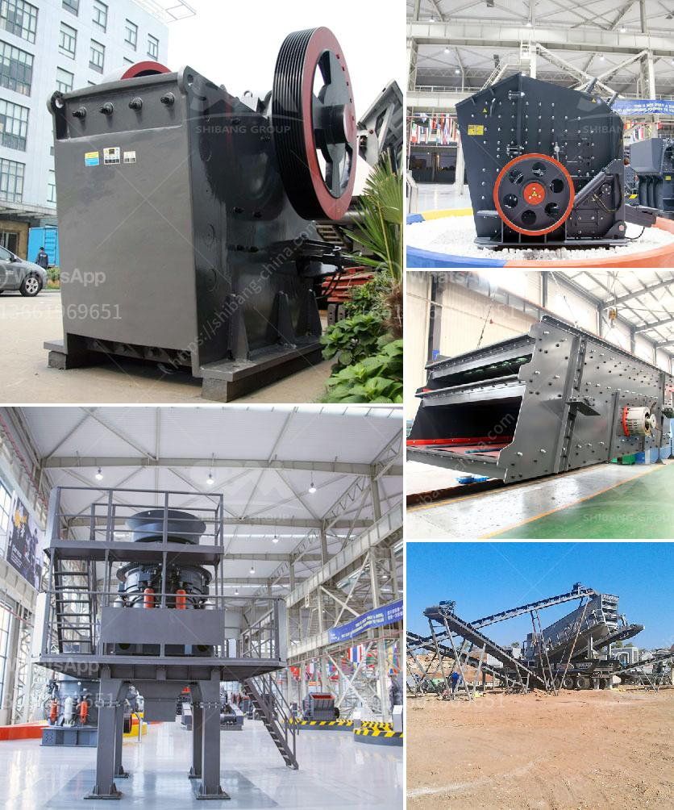

<h3>used granite crusher machinery</h3>
Used granite crusher machinery is a popular choice when operating in quarries and mines. It is designed to reduce large rocks into smaller pieces and is capable of handling a variety of materials, including granite, quartz, and limestone. This machine is commonly used in construction and road building projects due to its high efficiency and versatility.

One of the key features of this machinery is its robust construction. The frame and body of the crusher are built to withstand high impact forces, ensuring long-lasting durability. The heavy-duty components and thick wear-resistant plates enable the crusher to handle abrasive materials without damage, reducing maintenance costs.

The granite crusher machinery is equipped with advanced technology and innovative design, such as jaw crusher, impact crusher, and cone crusher. The rocks after processed by the machines are finely graded, uniform in size for various applications. Investment in this type of machinery can be a smart decision for both large and small-scale operations, as it allows operators to produce high-quality aggregates efficiently.

Moreover, used granite crusher machinery provides various options for customization. Different crushers can be selected depending on the final product requirements, allowing operators to choose the most suitable equipment for their specific needs. Additionally, the machinery can be equipped with various accessories such as vibrating screens and conveyor belts, further enhancing its efficiency and productivity.

In conclusion, used granite crusher machinery is a reliable, cost-effective option for quarry and mine operators. It offers high productivity and low operating costs, ensuring a strong return on investment. With its excellent durability and versatility, this machinery is an ideal choice for various applications in the construction industry. Buyers looking for quality used granite crusher machinery can explore reputable suppliers and manufacturers to find the most suitable equipment for their requirements.
<h3>Contact us</h3><ul><li><strong>Whatsapp:&nbsp;<a href="https://wa.me/8613661969651">+8613661969651</a></strong></li><li><a href="https://swt.shibang-china.com/?git&amp;zhl&amp;used granite crusher machinery"><strong>Online Service(chat now)</strong></a></li></ul><h3>Related</h3><ul><li><a href='different type of grinding mills.md'>different type of grinding mills</a></li><li><a href='crushing plant philippines.md'>crushing plant philippines</a></li><li><a href='chromite beneficiation plant in malaysia.md'>chromite beneficiation plant in malaysia</a></li><li><a href='buy mobile crusher.md'>buy mobile crusher</a></li><li><a href='zeolite sand making machine manufacturer.md'>zeolite sand making machine manufacturer</a></li></ul>