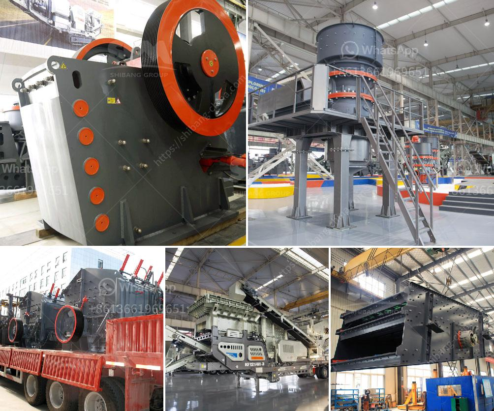

<h3>used granite crushers for sale</h3>
Granite is an igneous rock formed by the cooling and solidification of magma or lava deep below the Earth's surface. The term granite also refers to a group of intrusive igneous rocks that possess medium to coarse grains and are rich in quartz and feldspar. Granite is a commonly used material for many construction purposes including countertops, flooring, and paving stones. However, before granite can be used in these applications, it needs to be crushed into smaller pieces.

In the past, granite crushers were mainly large, expensive machines with a high horsepower and heavy-duty construction. These machines were used to make granite products for various applications. However, with the advancement in technology, smaller granite crushers can also be used in smaller production settings, making it possible to save money and resources by purchasing used granite crushers.

The market for used granite crushers is very broad and can be divided into different types according to the requirements of different users. Some users need to transfer the used granite crushers to achieve a seamless transition between different production sites. For these users, our company provides high-quality used granite crushers for sale to meet the needs of different customers.

Second-hand granite crushers have excellent performance on granite crushing. Compared with the traditional granite crusher, the new generation of granite crusher has more advanced technology and higher requirements for working conditions. It has strong crushing capacity and high crushing efficiency and can meet the demand for high-standard construction materials.

Before purchasing a used granite crusher, it is necessary to check the crushing efficiency, operating condition, and service life of the equipment to ensure that it meets the requirements for the production of high-quality granite products. Additionally, it is recommended to choose a reputable seller or dealer to ensure the quality and reliability of the used equipment.

In conclusion, used granite crushers for sale provide a cost-effective solution for the crushing of granite, saving both money and resources. With the advancement in technology, smaller granite crushers can also be used in smaller production settings, making it possible for more businesses and individuals to benefit from this equipment. However, it is essential to carefully evaluate the condition and performance of used granite crushers before making a purchase to ensure the smooth and efficient operation of the crushing process.
<h3>Contact us</h3><ul><li><strong>Whatsapp:&nbsp;<a href="https://wa.me/8613661969651">+8613661969651</a></strong></li><li><a href="https://swt.shibang-china.com/?git&amp;zhl&amp;used granite crushers for sale"><strong>Online Service(chat now)</strong></a></li></ul><h3>Related</h3><ul><li><a href='hammer mill nigeria.md'>hammer mill nigeria</a></li><li><a href='equipment cost for silica sand mining.md'>equipment cost for silica sand mining</a></li><li><a href='application of vertical grinding machine.md'>application of vertical grinding machine</a></li><li><a href='how to charge grinding media in ball mill.md'>how to charge grinding media in ball mill</a></li><li><a href='slag crusher machine india.md'>slag crusher machine india</a></li></ul>