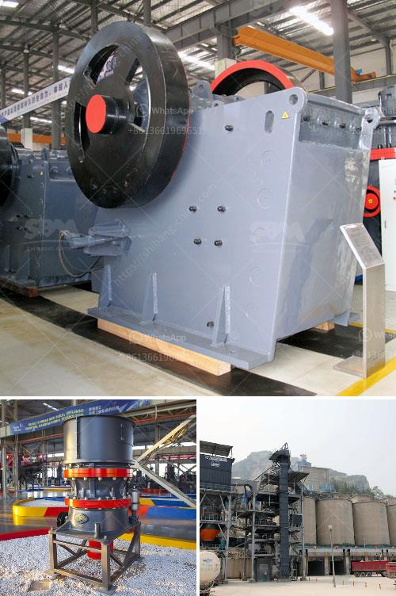

<h3>used grinding mills for sale</h3>
Are you in the market for a grinding mill? Look no further! Used grinding mills for sale can be a cost-effective option to enhance your manufacturing processes without the hefty price tag of buying new equipment. Whether you are in the mining, agriculture, or chemical industry, finding the right grinding mill for your operation is crucial for optimal performance and productivity.

Used grinding mills offer a variety of benefits that make them an attractive choice for many businesses. First and foremost, they are significantly more affordable than buying brand new equipment. This allows you to allocate your budget to other areas of your operation, such as investing in additional machinery or expanding your production capacity.

Additionally, used grinding mills have already been thoroughly tested and proven to be reliable. Many sellers provide detailed information about the mill's history, usage, and maintenance, enabling you to make an informed decision. By opting for a used mill, you can have peace of mind knowing that you are purchasing a tried and tested piece of equipment that is ready to perform.

Furthermore, the availability of used grinding mills allows for faster delivery times compared to waiting for the manufacturing and delivery of new equipment. This can be especially advantageous if you are looking to replace a faulty or outdated mill quickly, minimizing downtime and optimizing your production schedule.

However, it is important to conduct thorough research and due diligence when considering used grinding mills for sale. Look for reputable sellers who are known for providing quality products and excellent customer service. It is also advisable to inspect the equipment personally or request detailed pictures and videos to ensure that it meets your specific requirements.

In conclusion, used grinding mills for sale offer a cost-effective solution for businesses seeking to enhance their manufacturing processes. With the right research and due diligence, you can find a reliable and high-performing mill that fits your budget and operational needs. So why wait? Start your search for used grinding mills today and take your business to the next level.
<h3>Contact us</h3><ul><li><strong>Whatsapp:&nbsp;<a href="https://wa.me/8613661969651">+8613661969651</a></strong></li><li><a href="https://swt.shibang-china.com/?git&amp;zhl&amp;used grinding mills for sale"><strong>Online Service(chat now)</strong></a></li></ul><h3>Related</h3><ul><li><a href='raymond mill price list.md'>raymond mill price list</a></li><li><a href='custom milling for small scale mining.md'>custom milling for small scale mining</a></li><li><a href='cde sand wash plant for sale.md'>cde sand wash plant for sale</a></li><li><a href='ball mill for limestone grinding power calculation.md'>ball mill for limestone grinding power calculation</a></li><li><a href='processing plant for chrome for sale.md'>processing plant for chrome for sale</a></li></ul>