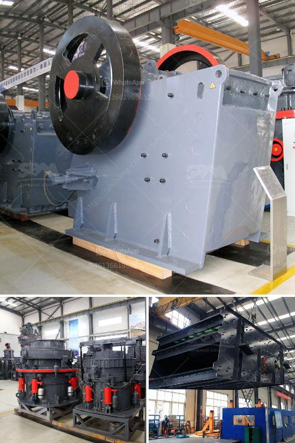

<h3>used in cement plant</h3>
Cement plants are known for their immense energy consumption and high emissions of greenhouse gases. However, with increasing concerns about environmental sustainability, the industry has been exploring various ways to improve its efficiency and reduce its carbon footprint. One important aspect of this transformation is the use of innovative technology and equipment that is specifically designed to optimize the cement production process.

Used equipment and machinery play a crucial role in the cement plant industry. They provide cost-efficient solutions while meeting the required quality standards. These used machines are carefully selected and refurbished before being deployed in cement plants.

One key area where used machinery can make a significant impact is energy consumption. Cement plants consume a great deal of energy in their operations, both in the form of electricity and fuel. By using high-quality used machinery, plants can ensure that energy is used optimally, leading to cost savings and reduced carbon emissions.

Another important aspect of the cement production process is the use of raw materials. The quality of raw materials directly impacts the quality of the final cement product. Used machinery in cement plants ensures that the raw materials are processed efficiently, resulting in a consistent and superior product. This not only improves customer satisfaction but also reduces waste and lowers production costs.

Additionally, using used machinery allows cement plants to reduce their capital expenditure. Investing in brand new equipment can be expensive, especially for smaller cement plants. By opting for refurbished machinery, these plants can significantly lower their upfront investment while still achieving high-quality production.

Furthermore, the use of used machinery promotes sustainability through recycling. Instead of being discarded, equipment that is no longer needed in one plant can be refurbished and repurposed for use in another. This helps reduce waste and prolong the lifespan of machinery, leading to a more environmentally-friendly industry.

In conclusion, the use of used machinery in cement plants presents numerous benefits, including enhanced energy efficiency, cost savings, improved quality, and reduced waste. As the cement industry strives towards a greener future, utilizing such equipment becomes even more relevant. By embracing innovative solutions and technologies, cement plants can successfully enhance their efficiency while reducing their environmental impact.
<h3>Contact us</h3><ul><li><strong>Whatsapp:&nbsp;<a href="https://wa.me/8613661969651">+8613661969651</a></strong></li><li><a href="https://swt.shibang-china.com/?git&amp;zhl&amp;used in cement plant"><strong>Online Service(chat now)</strong></a></li></ul><h3>Related</h3><ul><li><a href='roller stone crusher.md'>roller stone crusher</a></li><li><a href='industrial fine powder grinder.md'>industrial fine powder grinder</a></li><li><a href='companies selling mining equipment.md'>companies selling mining equipment</a></li><li><a href='used sand dryer for sale australia.md'>used sand dryer for sale australia</a></li><li><a href='primary jaw crusher saudi.md'>primary jaw crusher saudi</a></li></ul>