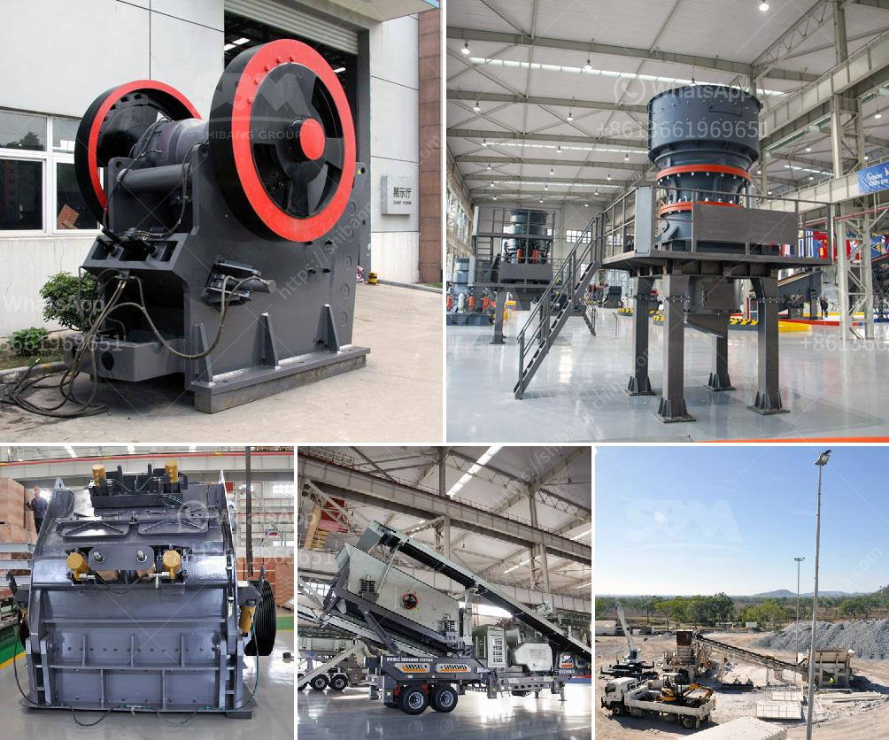

<h3>used portable crusher for sale in germany</h3>
In today's fast-paced world, the demand for construction equipment and machinery is ever-increasing. Whether it's for large-scale projects or smaller ventures, the need for efficient and reliable equipment is crucial. One such machine that has gained immense popularity in recent years is the portable crusher. With its ability to process materials on-site, it has revolutionized the construction industry. Germany, known for its engineering prowess, has a wide range of used portable crushers readily available for sale.

A used portable crusher offers an environment-friendly solution in reducing costs and providing certain environmental benefits. The portable crusher effectively deals with construction waste and recycles it on-site, eliminating the need for transportation, thus reducing carbon emissions. This has made it a popular choice for construction companies in Germany looking to minimize their environmental footprint.

The portable crusher is a versatile machine that can handle a wide range of materials such as concrete, rock, stone, and asphalt. It is powered by a diesel engine, making it very reliable and efficient. Its mobility allows it to be easily transported to different job sites, thus reducing downtime and increasing productivity.

One of the main advantages of a used portable crusher is its cost-effectiveness. It offers significant savings compared to purchasing a new crusher, making it a smart choice for businesses looking to optimize their budget. Additionally, a used portable crusher retains its value over time, ensuring a good resale value if the need arises.

Germany, with its numerous construction projects, has seen a steady rise in the demand for used portable crushers. This has led to a vibrant market, with a wide selection of models and brands available. From well-known manufacturers like Metso and Kleemann to niche companies, the options are abundant. Whether it's a compact crusher suitable for urban environments or a heavy-duty machine for larger projects, Germany offers a range of choices to cater to different needs.

When looking for a used portable crusher in Germany, it is essential to consider a few factors. Firstly, the condition of the machine should be thoroughly inspected to ensure it is in good working order. Checking for any signs of wear and tear and conducting a test run can give a better idea of its performance. It is also important to verify the machine's maintenance history to ensure proper maintenance has been carried out.

Another factor to consider is the size and capacity of the crusher. This will depend on the specific requirements of the project. It is crucial to choose a crusher that can handle the expected workload and produce the desired output. Additionally, considering factors such as fuel efficiency and ease of operation can contribute to a more efficient and productive work experience.

In conclusion, a used portable crusher offers numerous benefits for construction companies in Germany. From cost-effectiveness to environmental sustainability, it has become a go-to solution for processing materials on-site. The market for used portable crushers in Germany is thriving, providing a wide variety of options to suit different project requirements. By considering factors such as condition, size, and capacity, businesses can make an informed choice and find the perfect crusher for their needs.
<h3>Contact us</h3><ul><li><strong>Whatsapp:&nbsp;<a href="https://wa.me/8613661969651">+8613661969651</a></strong></li><li><a href="https://swt.shibang-china.com/?git&amp;zhl&amp;used portable crusher for sale in germany"><strong>Online Service(chat now)</strong></a></li></ul><h3>Related</h3><ul><li><a href='industrial fine powder grinder.md'>industrial fine powder grinder</a></li><li><a href='blast slag grinding machine india.md'>blast slag grinding machine india</a></li><li><a href='iron slag crusher india.md'>iron slag crusher india</a></li><li><a href='ball mill suppliers in hyderabad.md'>ball mill suppliers in hyderabad</a></li><li><a href='industrial roller mill.md'>industrial roller mill</a></li></ul>