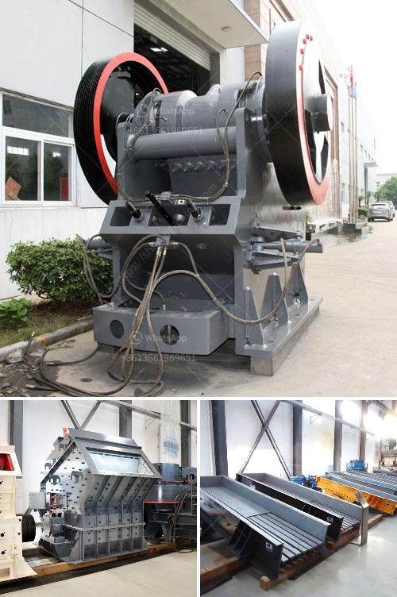

<h3>used rock crusher dealers in usa</h3>
Whether you are in the construction or mining industry, a rock crusher is an essential piece of equipment for processing large rocks into smaller ones. However, investing in a brand-new rock crusher may not always be the most cost-effective solution. This is where used rock crusher dealers in the USA come into play, offering a wide range of used crushers at competitive prices.

Used rock crusher dealers in the USA provide a wide range of crushers that cater to different material handling and production needs. From rippers to breaking hammers, excavators to loaders, rock crushers can be found for almost any task. Whether you need to crush limestone, granite, or any other mineral-rich rock, these experienced dealers will have the perfect solution for you.

One of the main advantages of buying a used rock crusher from a reputable dealer is the savings you can achieve. Used crushers are often available at a fraction of the cost of new ones. As long as the equipment is well-maintained and in good working condition, it can provide the same level of performance and reliability as a brand-new crusher.

Used rock crusher dealers in the USA also offer the added benefit of immediate availability. When you purchase a new crusher, there may be a waiting period for the manufacturing and delivery process. However, with used equipment, you can get your hands on a rock crusher right away, ensuring that you can meet your production goals without delays.

Furthermore, established dealers in the USA often have an extensive inventory of used crushers, allowing you to choose from different brands, models, and specifications. This flexibility ensures that you can find the perfect rock crusher for your specific needs, whether it's for primary crushing, secondary crushing, or tertiary crushing.

In conclusion, when it comes to buying a rock crusher, opting for a used one from a trusted dealer in the USA can be a wise decision. Not only can you save money, but you can also benefit from immediate availability and a wide range of options. So, if you're in need of a rock crusher, consider exploring the offerings of used rock crusher dealers in the USA to find the perfect solution for your business.
<h3>Contact us</h3><ul><li><strong>Whatsapp:&nbsp;<a href="https://wa.me/8613661969651">+8613661969651</a></strong></li><li><a href="https://swt.shibang-china.com/?git&amp;zhl&amp;used rock crusher dealers in usa"><strong>Online Service(chat now)</strong></a></li></ul><h3>Related</h3><ul><li><a href='stone crusher machine price in uganda.md'>stone crusher machine price in uganda</a></li><li><a href='mining rental equipment south africa.md'>mining rental equipment south africa</a></li><li><a href='quartz stone crushing process.md'>quartz stone crushing process</a></li><li><a href='charcoal pulverizer machine philippines.md'>charcoal pulverizer machine philippines</a></li><li><a href='concrete crusher for sale ethiopia.md'>concrete crusher for sale ethiopia</a></li></ul>