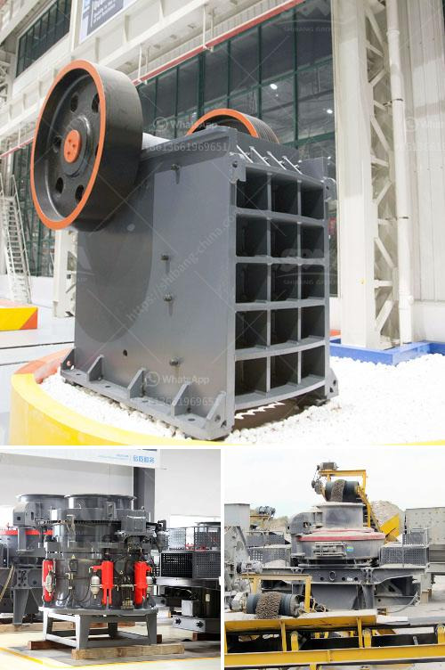

<h3>used rock crushing plant for sale in uae</h3>
Are you in the market for a used rock crushing plant for sale in UAE? If so, you’ve come to the right place. Purchasing a well-maintained, reliable machine is crucial for any business, especially those in the construction and mining industries. In this article, we will explore the benefits of purchasing a used rock crushing plant and discuss the steps that you should take to find the perfect machine for your needs.

The United Arab Emirates has a thriving construction industry, making it an ideal location for any business in need of heavy equipment. While new machines can be costly, a used rock crushing plant offers a more affordable alternative without compromising quality or performance. Whether you are expanding your operations or starting a new project, a used rock crushing plant can serve as a cost-effective solution.

One of the major advantages of purchasing a used rock crushing plant is that it has already proven its reliability and functionality in the field. When buying a used machine, you can review its performance history and inspect its mechanics to ensure that it is in good condition. Additionally, reputable sellers often offer warranties to provide you with peace of mind that your investment is protected.

Before purchasing a used rock crushing plant, you should evaluate your specific needs and requirements. Consider the type of rock materials you will be processing, the volume of production you aim to achieve, and your budget. Having a clear understanding of these factors will enable you to make a more informed decision when choosing a machine.

To find a used rock crushing plant for sale in UAE, you can start by conducting a thorough search online. This will provide you with access to a vast selection of machines available in different sizes, capacities, and price ranges. Take the time to compare models and prices from various sellers to ensure that you are getting the best deal possible.

When browsing through the listings for used rock crushing plants, look for detailed descriptions and specifications for each machine. This will allow you to assess whether it meets your requirements. Additionally, it is crucial to request high-resolution images and, if possible, schedule an inspection or a test run before finalizing the purchase.

If you are uncertain about the condition or suitability of a used rock crushing plant, it is wise to consult with an industry expert or hire a certified inspector. They will be able to evaluate the machine thoroughly and provide you with a professional opinion. While this may involve an additional cost, it can help you avoid investing in a machine that might not meet your expectations.

In conclusion, purchasing a used rock crushing plant for sale in UAE can be a cost-effective solution for businesses seeking to expand their operations or start new projects. By evaluating your specific needs and conducting thorough research, you can find a reliable machine that is capable of meeting your production goals. Remember to consider the machine's condition, warranty, and specifications before making a final decision.
<h3>Contact us</h3><ul><li><strong>Whatsapp:&nbsp;<a href="https://wa.me/8613661969651">+8613661969651</a></strong></li><li><a href="https://swt.shibang-china.com/?git&amp;zhl&amp;used rock crushing plant for sale in uae"><strong>Online Service(chat now)</strong></a></li></ul><h3>Related</h3><ul><li><a href='gold mining equipments africa.md'>gold mining equipments africa</a></li><li><a href='grinding zeolite ball mill machine.md'>grinding zeolite ball mill machine</a></li><li><a href='iron sand arator in philippines.md'>iron sand arator in philippines</a></li><li><a href='concrete grinding machine manufacturers.md'>concrete grinding machine manufacturers</a></li><li><a href='raymond vertical mill product size 3 30 micron.md'>raymond vertical mill product size 3 30 micron</a></li></ul>