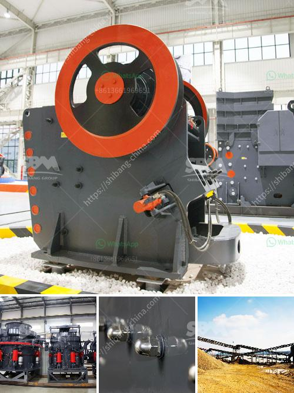

<h3>used sand dryer for sale australia</h3>
Used sand dryers have become a popular choice for various industrial applications in Australia. These versatile machines are specifically designed to remove the moisture content from sand, making it ideal for construction, foundry, and mining industries. Buying used sand dryers can offer several advantages, including cost-effectiveness and sustainability. In this article, we will delve into the efficiency and benefits of investing in a used sand dryer for sale in Australia.

One of the primary advantages of purchasing a used sand dryer is its cost-effectiveness. Buying used equipment can significantly reduce the initial investment compared to buying a brand-new dryer. As the initial depreciation has taken place, customers can often find pre-owned sand dryers at a fraction of the price, while still maintaining good operational condition. With cost-effectiveness at the forefront, businesses can allocate their budget to other essential areas, such as maintenance or expanding their operations.

Used sand dryers are designed to achieve high efficiency drying, ensuring quick and optimal moisture removal from the sand. This allows businesses to produce uniformly dried sand, critical for seamless production processes. With advanced features like heat regulation and precise temperature control, used sand dryers can guarantee precise drying results, thus increasing productivity and reducing production time.

Opting for a second-hand sand dryer also contributes to sustainable practices. By investing in used equipment, businesses encourage the reuse and recycling of mechanical resources, ultimately reducing environmental impact. Additionally, buying a used sand dryer helps reduce waste associated with the manufacturing process of new equipment, including raw materials, energy consumption, and transportation emissions.

Used sand dryers offer versatility and adaptability to various industries. The construction sector, for example, can benefit from a used sand dryer's ability to dry sand for cement and concrete production. The foundry industry can ensure uniform moisture levels in molding sands, enhancing the quality of castings. Moreover, mining companies can employ used sand dryers for drying frac sand, a crucial component in hydraulic fracturing operations. The broad range of applications makes used sand dryers a valuable asset to numerous industries, providing optimal moisture control and improved overall performance.

Used sand dryers for sale in Australia present an excellent opportunity for businesses to obtain cost-effective and efficient drying solutions. With their ability to remove moisture content from sand quickly and precisely, these second-hand machines facilitate streamlined production processes and increase productivity. Additionally, purchasing used equipment is a sustainable choice, minimizing environmental impact and fostering resource conservation. Thus, investing in a used sand dryer not only offers financial benefits but also contributes to the development of sustainable practices within industries.
<h3>Contact us</h3><ul><li><strong>Whatsapp:&nbsp;<a href="https://wa.me/8613661969651">+8613661969651</a></strong></li><li><a href="https://swt.shibang-china.com/?git&amp;zhl&amp;used sand dryer for sale australia"><strong>Online Service(chat now)</strong></a></li></ul><h3>Related</h3><ul><li><a href='brick making machine in zimbabwe.md'>brick making machine in zimbabwe</a></li><li><a href='crushing machine price in malaysia.md'>crushing machine price in malaysia</a></li><li><a href='coal crusher machine pdf.md'>coal crusher machine pdf</a></li><li><a href='how to start a stone crusher business.md'>how to start a stone crusher business</a></li><li><a href='breaker crusher used for coal crushing.md'>breaker crusher used for coal crushing</a></li></ul>