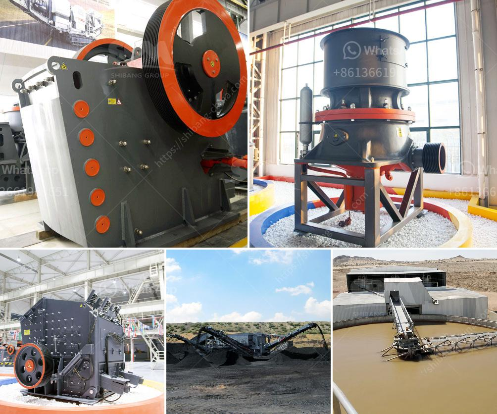

<h3>used triple horizontal vibrating screen for sale</h3>
If you are in the market for a high-quality vibrating screen at a lower price, a used triple horizontal vibrating screen may be the perfect solution for you. These screens are widely used in the mining, construction, and recycling industries to separate materials and ensure optimal sizing of the end product.

A triple horizontal vibrating screen consists of three decks stacked on top of each other. Each deck has its own screen mesh with different opening sizes, allowing for the efficient separation of various materials. The vibratory motion generated by these screens helps to remove fines and oversize particles, ensuring a clean and uniform final product.

One of the significant advantages of purchasing a used vibrating screen is cost savings. Used equipment is typically priced lower than new models, making it a cost-effective option for budget-conscious buyers. Additionally, buying used equipment eliminates the waiting time associated with ordering new equipment, allowing you to start using the screen right away.

When searching for a used triple horizontal vibrating screen, it is essential to consider the condition of the equipment and its maintenance history. Look for screens that have been well-maintained by their previous owners. A thorough inspection can help ensure that the screen is in good working condition and will serve your needs effectively.

It is also advisable to purchase from a reputable seller or dealer who can provide you with detailed information about the screen, including its specifications, age, and any warranties that may apply. Reputable sellers often offer inspection services, certification, and after-sales support, giving you peace of mind in your purchase.

In conclusion, if you are looking to purchase a triple horizontal vibrating screen on a budget, a used model may be the ideal choice. With proper inspection and buying from a reliable source, you can take advantage of the cost savings without compromising on performance. So, consider a used triple horizontal vibrating screen for sale and enhance your screening operations today.
<h3>Contact us</h3><ul><li><strong>Whatsapp:&nbsp;<a href="https://wa.me/8613661969651">+8613661969651</a></strong></li><li><a href="https://swt.shibang-china.com/?git&amp;zhl&amp;used triple horizontal vibrating screen for sale"><strong>Online Service(chat now)</strong></a></li></ul><h3>Related</h3><ul><li><a href='portable stone crusher machine in philippines.md'>portable stone crusher machine in philippines</a></li><li><a href='ball mills for grinding lime.md'>ball mills for grinding lime</a></li><li><a href='coal vibration equipment size.md'>coal vibration equipment size</a></li><li><a href='rock crusher machines.md'>rock crusher machines</a></li><li><a href='equipment use in the mining of laterite.md'>equipment use in the mining of laterite</a></li></ul>