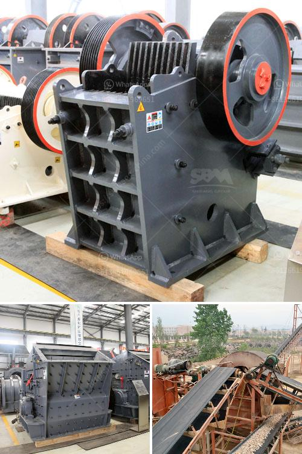

<h3>usina de minerio de ferro para venda no mexico</h3>
A Usina de Minério de Ferro para Venda no México é um empreendimento que tem despertado interesse no setor de mineração e siderurgia. Localizado em um país estrategicamente posicionado para o comércio internacional, o México se destaca pelo potencial de mercado e pela abundância de recursos naturais.

O minério de ferro é uma das commodities mais importantes para a indústria global, sendo utilizado na fabricação de aço e em uma ampla gama de produtos. É por isso que a mineração desse material tem sido um negócio lucrativo em diversos países ao redor do mundo.

A Usina de Minério de Ferro para Venda no México oferece uma oportunidade única para investidores que desejam explorar esse mercado em ascensão. O país possui uma vasta reserva mineral, com diversos locais propícios para a extração de minério de ferro. Além disso, o México possui uma localização geográfica estratégica que facilita o transporte e o acesso aos principais mercados consumidores.

A usina em questão está equipada com tecnologia de ponta e possui capacidade produtiva significativa. Isso significa que os investidores terão a oportunidade de operar uma planta atualizada e eficiente, que atende aos mais altos padrões de qualidade e sustentabilidade.

Além disso, o México possui uma mão de obra qualificada e competitiva, o que reduz os custos operacionais e aumenta a eficiência do empreendimento. A disponibilidade de trabalhadores experientes e treinados garante uma produção contínua e de alta qualidade, o que é essencial para alcançar o sucesso nessa indústria.

Outro fator atraente para investidores é o mercado consumidor local e regional. O México é um dos maiores produtores e consumidores de aço na América Latina, o que significa uma demanda garantida para o minério de ferro produzido pela usina. Além disso, a proximidade com os Estados Unidos e outros países da América do Norte torna o mercado ainda mais promissor, visto que a demanda por minério de ferro nessa região é bastante significativa.

Por último, mas não menos importante, é importante ressaltar o potencial de crescimento da indústria siderúrgica no México. Com a retomada da economia global após a crise causada pela pandemia da COVID-19, espera-se um aumento na demanda por aço e, consequentemente, por minério de ferro. Investir nesse setor agora pode garantir um retorno financeiro sólido e duradouro.

Portanto, a Usina de Minério de Ferro para Venda no México representa uma oportunidade única para investidores interessados em explorar um mercado em expansão e com grande potencial de crescimento. Com uma localização estratégica, tecnologia moderna, mão de obra qualificada e um mercado consumidor promissor, esse empreendimento tem todos os ingredientes necessários para se tornar um sucesso.
<h3>Contact us</h3><ul><li><strong>Whatsapp:&nbsp;<a href="https://wa.me/8613661969651">+8613661969651</a></strong></li><li><a href="https://swt.shibang-china.com/?git&amp;zhl&amp;usina de minerio de ferro para venda no mexico"><strong>Online Service(chat now)</strong></a></li></ul><h3>Related</h3><ul><li><a href='equipment needed for quarry crusher.md'>equipment needed for quarry crusher</a></li><li><a href='companies crushing plant.md'>companies crushing plant</a></li><li><a href='low cost gold mining equipment gold mining equipment.md'>low cost gold mining equipment gold mining equipment</a></li><li><a href='raymond mill price list.md'>raymond mill price list</a></li><li><a href='hammer mill nigeria.md'>hammer mill nigeria</a></li></ul>